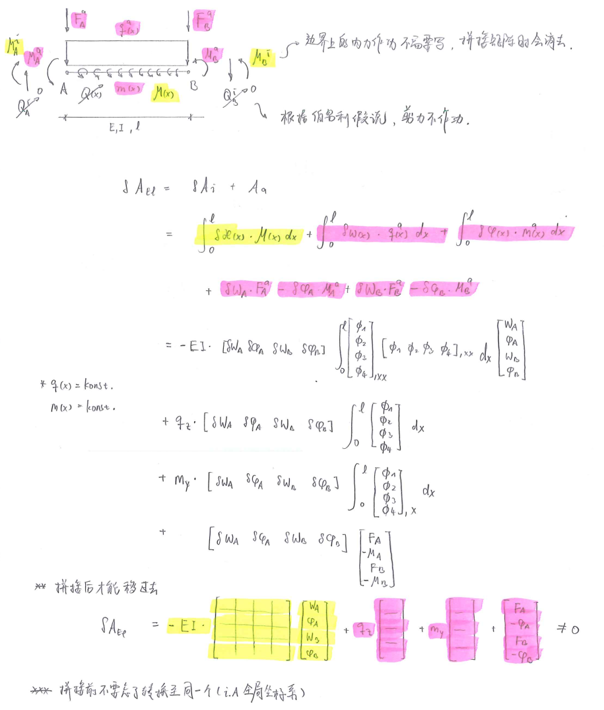

# Basic Elemental Functions

## Kinematics

$$
\begin{align}
\kappa & = \phi_{,x} 
\\
\phi & = w_{,x}
\\
\Rightarrow \kappa& =w_{,xx}
\end{align}
$$

## Material

$$
M=-EI\cdot\kappa
$$

## Elemetental Virtual Work Function

$$
\begin{align}
\delta A & = \int \delta\kappa(x)\cdot M(x)dx + \int \delta w(x) \cdot p_z(x)dx  \\
& = \int_0^l\delta w(x)_{,xx}\cdot -EI\cdot w_{,xx} dx+ \int_0^l \delta w(x) \cdot p_z(x)dx
\end{align}
$$

# With Shape Functions

$$
w(x)
= \begin{pmatrix} \phi_1 & \phi_2 & \phi_3 & \phi_4 \end{pmatrix}
\begin{pmatrix} w_A \\ \varphi_A \\ w_B \\ \varphi_B \end{pmatrix}
=\phi_1 \cdot w_A + \phi_2 \cdot \varphi_A+\phi_3\cdot w_B + \phi_4 \cdot \varphi_B
$$

## Hermite Interpolation Functions

| $i$  | $\phi_i(x)$                             | $\phi_i(x)_{,x}$                   | $\phi_i(x)_{,xx}$                 | $\phi_i(x)_{,xxx}$ |
| :--- | --------------------------------------- | ---------------------------------- | --------------------------------- | ------------------ |
| $1$  | $1 - 3\frac{x^2}{l^2}+2\frac{x^3}{l^3}$ | $-6\frac{x}{l^2}+6\frac{x^2}{l^3}$ | $-6\frac{1}{l^2}+12\frac{x}{l^3}$ | $\frac{12}{l^3}$   |
| $2$  | $x-2\frac{x^2}{l}+\frac{x^3}{l^2}$      | $1-4\frac{4}{l}+3\frac{x^2}{l^2}$  | $-4\frac{1}{l}+6\frac{x}{l^2}$    | $\frac{6}{l^2}$    |
| $3$  | $3\frac{x^2}{l^2}-2\frac{x^3}{l^3}$     | $6\frac{x}{l^2}-6\frac{x^2}{l^3}$  | $6\frac{1}{l^2}-12\frac{x}{l^3}$  | $-\frac{12}{l^3}$  |
| $4$  | $-\frac{x^2}{l}+\frac{x^3}{l^2}$        | $-2\frac{x}{l}+3\frac{x^2}{l^2}$   | $-2\frac{1}{l}+6\frac{x}{l^2}$    | $\frac{6}{l^2}$    |

## Local Element Stiffness Matrix

$$
K_{el,lo}= EI\cdot
\begin{pmatrix} 
12/l^3 & 6/l^2 & -12/l^3 & 6/l^2 \\
6/l^2 & 4/l & -6/l^2 & 2/l \\
-12/l^3 & -6/l^2 & 12/l^3 & -6/l^2 \\
6/l^2 & 2/l & - 6/l^2 & 4/l
\end{pmatrix}
$$

## Force Vector

For $p_z(x)=const.$
$$
\int \delta w(x)\cdot p_zdx
= p_z\cdot \begin{pmatrix}\delta w_A & \delta \varphi_A & \delta w_B & \delta \varphi_B\end{pmatrix} 
\int \begin{pmatrix} \phi_1 \\ \phi_2 \\ \phi_3 \\ \phi_4 \end{pmatrix} dx
$$

$$
\pmb{f}=p_z\cdot\begin{pmatrix}l/2 \\ l^2/12 \\ l/2 \\-l^2/12 \end{pmatrix}
$$

# Post Processing

All in Local Coordinate Systems

弯矩计算模型

$$
\begin{align}
M(x) & = -EI\cdot\kappa(x) = -EI \cdot w(x)_{,xx} = -EI \cdot \phi(x)_{,xx} \cdot w\\
\\
\begin{pmatrix} M_A=M(x=0) \\ M_B=M(x=l) \end{pmatrix} 
&= -EI \cdot 
\begin{pmatrix} \phi_{1,xx}(x=0) & \phi_{2,xx}(x=0) & \phi_{3,xx}(x=0) &  \phi_{4,xx}(x=0) \\
\phi_{1,xx}(x=l) & \phi_{2,xx}(x=l) & \phi_{3,xx}(x=l) &  \phi_{4,xx}(x=l)\end{pmatrix}
\begin{pmatrix} w_A \\ \varphi_A \\ w_B \\ \varphi_B \end{pmatrix} \\
\\
\begin{pmatrix} M_A=M(x=0) \\ M_B=M(x=l) \end{pmatrix} 
&= -EI \cdot 
\begin{pmatrix} -6/l^2 & -4/l & 6/l^2 &  -2/l \\
6/l^2 & 2/l & -6/l^2 &  4/l\end{pmatrix}
\begin{pmatrix} w_A \\ \varphi_A \\ w_B \\ \varphi_B \end{pmatrix}
\end{align}
$$

剪力计算模型

$$
\begin{align}
Q(x)=M_{,x} & = -EI\cdot w(x)_{,xxx}=-EI\cdot \phi(x)_{,xxx}\cdot w \\ 
\\
\begin{pmatrix} Q_A=Q(x=0) \\ Q_B=Q(x=l) \end{pmatrix} 
&= -EI \cdot 
\begin{pmatrix} \phi_{1,xxx}(x=0) & \phi_{2,xxx}(x=0) & \phi_{3,xxx}(x=0) &  \phi_{4,xxx}(x=0) \\
\phi_{1,xxx}(x=l) & \phi_{2,xxx}(x=l) & \phi_{3,xxx}(x=l) &  \phi_{4,xxx}(x=l)\end{pmatrix}
\begin{pmatrix} w_A \\ \varphi_A \\ w_B \\ \varphi_B \end{pmatrix} \\
\\
\begin{pmatrix} Q_A=Q(x=0) \\ Q_B=Q(x=l) \end{pmatrix} 
&= -EI \cdot 
\begin{pmatrix} 12/l^3 & 6/l^2 & -12/l^3 &  6/l^2 \\
12/l^3 & 6/l^2 & -12/l^3 &  6/l^2 \end{pmatrix}
\begin{pmatrix} w_A \\ \varphi_A \\ w_B \\ \varphi_B \end{pmatrix} 
\end{align}
$$

Put it together: 
$$
\begin{pmatrix} Q_A \\ M_A \\ Q_B  \\ M_B \end{pmatrix} 
= EI \cdot 
\begin{pmatrix} 
- 12/l^3 & -6/l^2 & 12/l^3 &  -6/l^2 \\
6/l^2 & 4/l & -6/l^2 &  2/l \\
-12/l^3 & -6/l^2 & 12/l^3 & -6/l^2 \\
-6/l^2 & -2/l & 6/l^2 &  -4/l \\
\end{pmatrix}
\begin{pmatrix} w_A \\ \varphi_A \\ w_B \\ \varphi_B \end{pmatrix}
$$

