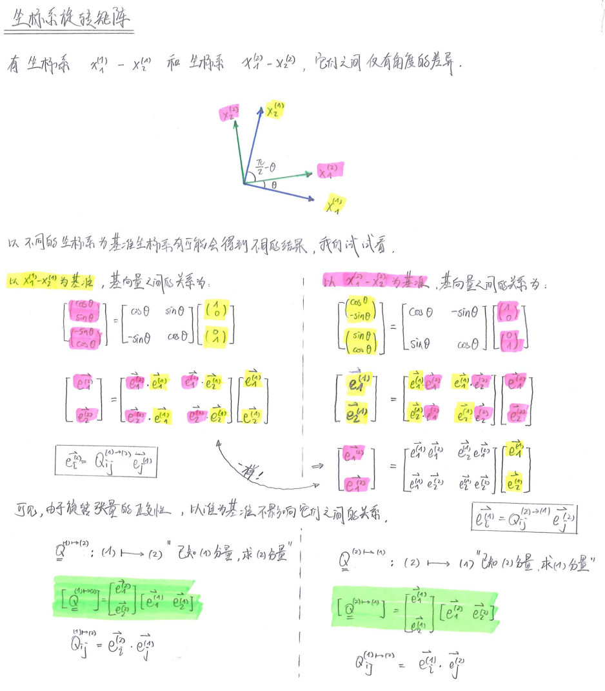
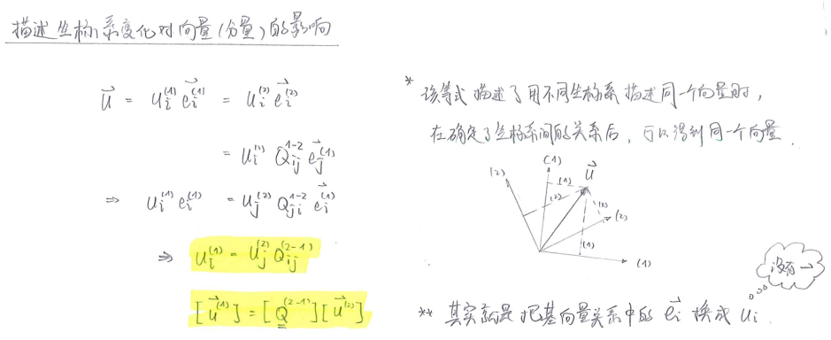
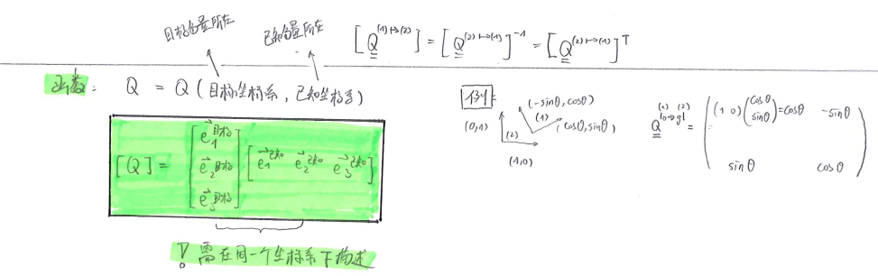
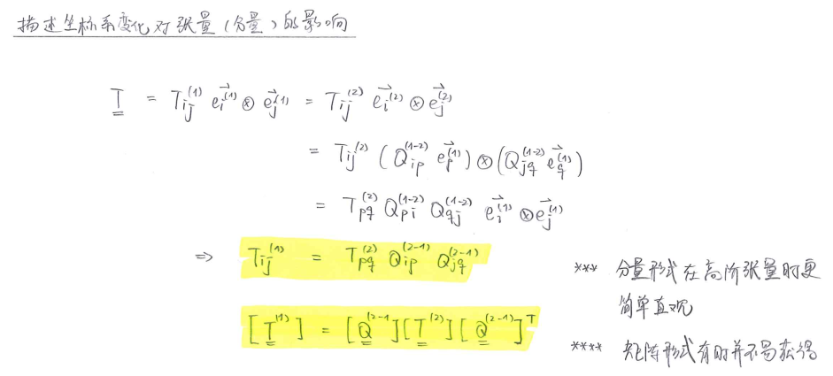
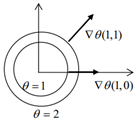
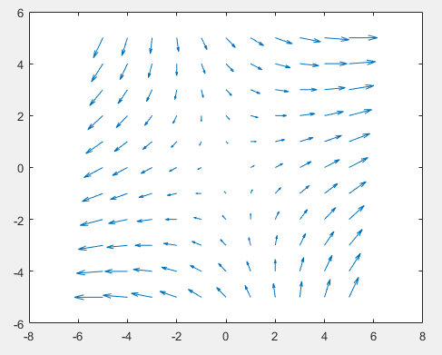
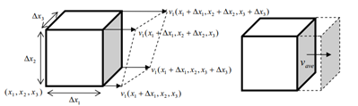
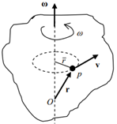

# 向量

## 概念

向量是由计算方法定义出的实体。

一个可以称作向量的实体，需要满足以下两条计算规则：

- 加法：平行四边形定理
- 标量乘法

向量 $\pmb{a}$ 的长度称作向量的模，记作 $$|\pmb{a}|$$。

向量本身是不需要定义在坐标系上的。

## 点积

两个向量的点积是一个标量：
$$
\pmb{a}\cdot\pmb{b}=|\pmb{a}||\pmb{b}|cos(\pmb{a},\pmb{b})
$$
点积可以用来描述向量垂直：
$$
\pmb{a}\cdot\pmb{b}=0 
\Leftrightarrow
\pmb{a} \bot \pmb{b}
$$
向量的模可以通过点积自己得到：
$$
|\pmb{a}| = \sqrt{\pmb{a} \cdot \pmb{a}}
$$
向量乘以某方向的单位向量，可以得到投影长度：
$$
a_x=\pmb{a}\cdot\pmb{e}_x
$$
笛卡尔坐标系下的矩阵记法：
$$
\pmb{a} \cdot \pmb{b} 
= 
\begin{pmatrix}
a_1 & a_2 & a_3
\end{pmatrix}
\cdot 
\begin{pmatrix}
b_1 \\ b_2 \\b_3
\end{pmatrix}
= a_1b_1+a_2b_2+a_3b_3
$$
笛卡尔坐标系下的指标记法：
$$
\pmb{a} \cdot \pmb{b} 
= a_i \pmb{e}_i \cdot b_j \pmb{e}_j 
= a_ib_j \delta_{ij}
= a_ib_i
$$

## 叉积

两个向量的叉积是一个向量：

- 其方向遵循右手定则

- 其模为
  $$
  |\pmb{a}||\pmb{b}|sin(\pmb{a},\pmb{b})
  $$


叉积的物理意义，是两个向量围成的平行四边形的面积。

之后可以用来描述面元。

叉积可以用来描述向量平行：
$$
\pmb{a} \times \pmb{b} = \pmb{0} 
\Leftrightarrow
\pmb{a} \parallel \pmb{b}
$$
笛卡尔坐标系下的矩阵记法：
$$
\pmb{a} \times \pmb{b}
= det 
\begin{pmatrix}
\pmb{e}_1 & \pmb{e}_2 & \pmb{e}_3 \\
a_1 & a_2 & a_3 \\
b_1 & b_2 & b_3
\end{pmatrix}
$$
笛卡尔坐标系下的指标记法：
$$
\pmb{a} \times \pmb{b}
= a_i \pmb{e}_i \times b_j \pmb{e}_j
= a_ib_j\varepsilon_{ijk}\pmb{e}_k
$$

## 三重积

$$
[\pmb{a}, \pmb{b}, \pmb{c}] 
= \pmb{a} \cdot (\pmb{b} \times \pmb{c}) 
= (\pmb{a} \times \pmb{b}) \cdot \pmb{c}
$$

三重积的物理意义是三个向量围成的平行六面体的体积。

之后可以用来描述微元。

其几何意义是三个向量组成的平行六面体的体积。

用三重积可以定义张量的行列式：

<center> 空间线性变化前后的单位空间体积的大小比

## 坐标系变换

坐标系的变换，就是不同坐标系下，表示向量的分量不同。

我们这里研究一个坐标系相对另一个坐标系有转动时，分量的变化。

坐标系平动并不会造成向量分量的变化，坐标系的拉伸会导致空间的变化，不在我们的研究范围。

鉴于坐标系变换非常容易混乱，特作手写笔记如下：





编程时考虑：




# 张量

## Dyad 和 Dyadics

张量就是线性映射。

作为一种线性算子，总有：
$$
\pmb{T}(\alpha\pmb{u}+\beta\pmb{v})=\pmb{T}(\alpha\pmb{u})+\pmb{T}(\beta\pmb{v})=\alpha\pmb{T}\pmb{u}+\beta\pmb{T}\pmb{v}
$$
有一种线性算子，其由两个向量组成，记作 $\pmb{a} \otimes \pmb{b}$ ，它表示的线性变换为：
$$
(\pmb{a} \otimes \pmb{b})\cdot \pmb{c}
=\pmb{a}(\pmb{b}\cdot \pmb{c})
$$
称其为 Dyad 并矢。

可以用矩阵形式表达两个向量的圈乘，这满足它的定义：
$$
\pmb{a} \otimes \pmb{b} = 
[\pmb{a}][\pmb{b}]^T = 
\begin{pmatrix}
a_{1}b_{1} & a_{1}b_{2} & a_{1}b_{3} \\
a_{2}b_{1} & a_{2}b_{2} & a_{2}b_{3} \\
a_{3}b_{1} & a_{3}b_{2} & a_{3}b_{3} \\
\end{pmatrix}
$$
定义 Dyad 的线性组合为 Dyadics，即：
$$
\alpha(\pmb{a}\otimes\pmb{b}) + \beta(\pmb{c}\otimes\pmb{d}) + \gamma(\pmb{e}\otimes\pmb{f}) + ...
$$
一个二阶张量总可以写成 Dyadics 的形式，有：
$$
\pmb{T} =
\pmb{u}\otimes \pmb{e}_1 + \pmb{v}\otimes \pmb{e}_2 + \pmb{w}\otimes \pmb{e}_3
$$
推导如下：
$$
\begin{align}
\pmb{T}(\pmb{a}) & = \pmb{b} \\
\pmb{T}(a_i\pmb{e}_i) & = \pmb{b} \\
a_1 \underbrace{\pmb{T}(\pmb{e}_1)}_{\pmb{u}} +
a_2 \underbrace{\pmb{T}(\pmb{e}_2)}_{\pmb{v}} +
a_3 \underbrace{\pmb{T}(\pmb{e}_3)}_{\pmb{w}} 
& = \pmb{b}\\ 
a_1\pmb{u} + a_2\pmb{v} + a_3\pmb{w} & = \pmb{b} \\
(\pmb{a}\cdot \pmb{e}_1)\pmb{u} + 
(\pmb{a}\cdot \pmb{e}_2)\pmb{v} + 
(\pmb{a}\cdot \pmb{e}_3)\pmb{w} & = \pmb{b} \\
(\pmb{u}\otimes \pmb{e}_1)\pmb{a} + 
(\pmb{v}\otimes \pmb{e}_2)\pmb{a} + 
(\pmb{w}\otimes \pmb{e}_3)\pmb{a} & = \pmb{b} \\
(\pmb{u}\otimes \pmb{e}_1 + \pmb{v}\otimes \pmb{e}_2 + \pmb{w}\otimes \pmb{e}_3)\pmb{a} & = \pmb{b} 
\end{align}
$$


可以接着推出张量的的分量形式：
$$
\begin{align}
\pmb{T} 
%%%%%%%%%%%%%%%%%%%
& = &
& \pmb{u} \otimes \pmb{e}_1 
&+ 
& \pmb{v}\otimes \pmb{e}_2 
&+ 
& \pmb{w}\otimes \pmb{e}_3 \\
%%%%%%%%%%%%%%%%%%%
& = &
& (u_i\pmb{e}_i)\otimes\pmb{e}_1 
&+ 
&(v_i\pmb{e}_i)\otimes\pmb{e}_2
&+ 
&(w_i\pmb{e}_i)\otimes\pmb{e}_3 \\
%%%%%%%%%%%%%%%%%%%
\\
& = &
& u_1 \pmb{e}_1 \otimes \pmb{e}_1 
& +
& u_2 \pmb{e}_2 \otimes \pmb{e}_1 
& +
& u_3 \pmb{e}_3 \otimes \pmb{e}_1 \\
& &+ 
& v_1 \pmb{e}_1 \otimes \pmb{e}_2 
& +
& v_2 \pmb{e}_2 \otimes \pmb{e}_2 
& +
& v_3 \pmb{e}_3 \otimes \pmb{e}_2 \\
& &+ 
& w_1 \pmb{e}_1 \otimes \pmb{e}_3 
& +
& w_2 \pmb{e}_2 \otimes \pmb{e}_3 
& +
& w_3 \pmb{e}_3 \otimes \pmb{e}_3 \\
%%%%%%%%%%%%%%%%%%%
\\
& = & 
& T_{11} \pmb{e}_1 \otimes \pmb{e}_1 
& +
& T_{21} \pmb{e}_2 \otimes \pmb{e}_1 
& +
& T_{31} \pmb{e}_3 \otimes \pmb{e}_1 \\
& &+ 
& T_{12} \pmb{e}_1 \otimes \pmb{e}_2 
& +
& T_{22} \pmb{e}_2 \otimes \pmb{e}_2 
& +
& T_{32} \pmb{e}_3 \otimes \pmb{e}_2 \\
& &+ 
& T_{13} \pmb{e}_1 \otimes \pmb{e}_3 
& +
& T_{23} \pmb{e}_2 \otimes \pmb{e}_3 
& +
& T_{33} \pmb{e}_3 \otimes \pmb{e}_3 \\
%%%%%%%%%%%%%%%%%%%%%
\\
\pmb{T} & = & 
&T_{ij} \pmb{e}_i \otimes \pmb{e}_j
\end{align}
$$
可以看出一个三维空间中的二阶张量有九个分量，其可以写成 $3\times3$ 的矩阵形式，这满足它的定义。
$$
\pmb{T} = 
[\pmb{T}] = 
\begin{pmatrix}
T_{11} & T_{12} & T_{13} \\
T_{21} & T_{22} & T_{23} \\
T_{31} & T_{32} & T_{33} \\
\end{pmatrix}
$$
$\pmb{e}_i \otimes \pmb{e}_j$ 告诉我们，这个分量处于由 $\pmb{e}_i$ 为基构成的矩阵的第 $i$ 列，第 $j$ 行。

从推导中我们可以看出，实际上不需要是笛卡尔坐标系，任何坐标系的基又可以完成这一推导，只是分量会有所不同，有：
$$
\pmb{T} 
= T_{ij} \pmb{e}_i \otimes \pmb{e}_j 
= T_{ij}^g \pmb{g}_i \otimes \pmb{g}_j
$$
很容易可以从笛卡尔坐标系的正交性得出，张量在某笛卡尔坐标系下的分量（算一算就明白）
$$
T_{ij}= \pmb{e}_i \cdot \pmb{T} \cdot \pmb{e}_j
$$
这个和向量在笛卡尔坐标系下的分量 $u_i=\pmb{u} \pmb{e}_i$ 存在形式上的统一。

## 单点缩并

二阶张量缩并向量：
$$
\begin{align}
\mathbf{T}\mathbf{u} 
& = T_{ij}\mathbf{e}_i\otimes\mathbf{e}_ju_k\mathbf{e}_k
=T_{ij}u_k  \delta_{jk} \mathbf{e}_i  \\
& = T_{ij}u_j\mathbf{e}_i
\end{align}
$$
二阶张量缩并二阶张量：
$$
\begin{align}
\mathbf{A} \mathbf{B} 
& =
A_{ij}\mathbf{e}_i\otimes\mathbf{e}_j 
B_{kl}\mathbf{e}_k\otimes\mathbf{e}_l 
= A_{ij}B_{kl} \delta_{jk} (\mathbf{e}_i\otimes\mathbf{e}_l) \\
\\
& = A_{ij}B_{jl} (\mathbf{e}_i\otimes\mathbf{e}_l)
\end{align}
$$
张量的正整数幂：

<center>张量的 $n$ 次幂就是对一个张量做 $n$ 次单点缩并，可以使用递推定义：

$$
\begin{cases}
\mathbf{T}^0 = \mathbf{I} \\
\mathbf{T}^n = \mathbf{T}^{n-1}\mathbf{T}
\end{cases}
$$

## 双点缩并

Dyad 的双点缩并【前前后后】：
$$
\begin{align}
(\mathbf{a}\otimes\mathbf{b}):(\mathbf{c}\otimes\mathbf{d})
& = (\mathbf{a} \cdot \mathbf{c})(\mathbf{b} \cdot \mathbf{d}) \\
\end{align}
$$
Triadics 的双点缩并：
$$
\begin{align}
(\mathbf{a}\otimes\mathbf{b}\otimes\mathbf{c}):(\mathbf{d}\otimes\mathbf{e}\otimes\mathbf{f})
& = (\mathbf{b} \cdot \mathbf{d}) (\mathbf{c} \cdot \mathbf{e}) \mathbf{a}\otimes\mathbf{f} \\
\end{align}
$$
Dyad 和 Triadics 的双点缩并：
$$
\begin{align}
(\mathbf{a}\otimes\mathbf{b}\otimes\mathbf{c}):(\mathbf{d}\otimes\mathbf{e})
& = (\mathbf{b} \cdot \mathbf{d}) (\mathbf{c} \cdot \mathbf{e}) \mathbf{a} \\
(\mathbf{a}\otimes\mathbf{b}):(\mathbf{c}\otimes \mathbf{d}\otimes\mathbf{e}) 
& = (\mathbf{a} \cdot \mathbf{c}) (\mathbf{b} \cdot \mathbf{d}) \mathbf{e} & not \ sure\ yet\\
\end{align}
$$
张量的双点缩并：
$$
\mathbf{A} : \mathbf{B} = A_{ij} B_{ij} = tr(\mathbf{A}^T\cdot\mathbf{B})
$$
横双点缩并：
$$
\begin{align}
(\mathbf{a}\otimes\mathbf{b}) \cdot \cdot (\mathbf{c}\otimes\mathbf{d}) 
& = (\mathbf{b} \cdot \mathbf{c})(\mathbf{a} \cdot \mathbf{d}) \\
(\mathbf{a}\otimes\mathbf{b}\otimes\mathbf{c})\cdot \cdot (\mathbf{d}\otimes\mathbf{e}\otimes\mathbf{f})
& =  (\mathbf{b} \cdot \mathbf{e}) (\mathbf{c} \cdot \mathbf{d}) \mathbf{a}\otimes\mathbf{f} 
\end{align}
$$

## 坐标系变换



# 特征分解

# 标量场

## 标量场的梯度

定义下面这种计算的结果为梯度：
$$
grad \big( \phi(\mathbf{x}) \big)
= \frac{\partial \phi(\pmb{x})}{\partial\pmb{x}}
=\nabla \phi(\mathbf{x}) 
= \mathbf{e}_i \frac{\partial \phi }{\partial x_i}
$$
标量场梯度的物理意义可以通过泰勒级数看出。

由于场函数微分的定义和普通函数一样，我们可以对标量场函数使用泰勒级数展开

> 泰勒级数
> $$
> \begin{align}
> f(x) 
> & = \sum_{k=0}^{\infty} \frac{1}{k!} f(x=x_0)^{(k)}\cdot(x-x_0)^k \\
> \\
> & =f(x=a)+f'(x=a)\cdot(x-a)+f''(x=a)\cdot(x-a)^2+...\\
> \\
> f(x)& = \sum_{k=0}^{\infty} \frac{1}{k!} \frac{\partial^kf(x)}{\partial x^k}|_{x=x_0}\cdot(x-x_0)^k 
> \end{align}
> $$
> $x_0=0$ 的泰勒级数称作麦克劳林级数
> $$
> \begin{align}
> f(x)  =f(0)+f'(x=0)\cdot x+f''(x=0)\cdot x^2+...
> \end{align}
> $$
>

有：
$$
\begin{align}
\phi(\mathbf{x}+d\mathbf{x}) 
& = \phi(\mathbf{x}) + \frac{\partial\phi(\mathbf{x})}{\partial\mathbf{x}}\cdot \Big( (\mathbf{x}+d\mathbf{x})-\mathbf{x} \Big) + \underbrace{...}_{高阶小量} \\
\\
& \approx \phi(\mathbf{x}) + \frac{\partial\phi(\mathbf{x})}{\partial\mathbf{x}}\cdot d\pmb{x}  \\
\\
d\phi(\mathbf{x}) &= \phi(\pmb{x}+d\pmb{x})-\phi(\pmb{x})
 =   grad(\phi) \cdot d\mathbf{x}
\end{align}
$$
标量场的梯度描述了标量场中，空间点上的标量值，在每个方向的变化向量的和，是三维空间中的“斜率”。

由于三维空间有很多方向可以走，梯度函数指出了，在空间中，朝哪个方向的变化最大。（存疑）

例：二维温度场的梯度

> 求环状二维温度场 $\theta(\mathbf{x}) = x_1^2 +x_2^2$ 的梯度
> $$
> \begin{align}
> \nabla \theta 
> = \frac{\partial\theta}{\partial x_i}\mathbf{e}_i 
> = \frac{\partial(x_1^2+x_2^2)}{\partial x_1}\mathbf{e}_1
> +  \frac{\partial(x_1^2+x_2^2)}{\partial x_2}\mathbf{e}_2
> = 2x_1\mathbf{e_1}+2x_2\mathbf{e}_2
> \end{align}
> $$
> 
> 可以看出：
>
> - 标量场的梯度函数和标量场垂直
> - $\theta$ 的变化在梯度方向上最大
> - $\theta$ 的变化在垂直于梯度方向的方向上最小

## 标量场的方向导数

Directional Derivative

函数 $\phi(\pmb{x})$ 在某方向 $\pmb{w}$ 的方向导数，就是函数在这个方向向量上的变化量。

函数的变化量，有：
$$
d\phi=\phi(\pmb{x}+\pmb{w})-\phi(\pmb{x})
$$
要得到此表达，我们引入一个新变量 $\varepsilon$ ，并考察函数 $\phi=\phi(\varepsilon)=\phi(\pmb{x}+\varepsilon\pmb{w})$。

对固定点 $\varepsilon=0$ 作泰勒展开，有：
$$
\phi(\pmb{x}+\varepsilon\pmb{w})=\phi(\pmb{x})+\frac{\partial\phi(\pmb{x}+\varepsilon\pmb{w})}{\partial\varepsilon}|_{\varepsilon=0}\cdot\varepsilon+...
$$
我们需要考虑 $\varepsilon=1​$ 的时候，此时 $\phi(\pmb{x}+\varepsilon\pmb{w})=\phi(\pmb{x}+\pmb{w})​$。

此时，泰勒展开式为：
$$
\begin{align}
\phi(\pmb{x}+\pmb{w})
& =\phi(\pmb{x})+\frac{\partial\phi(\pmb{x}+\varepsilon\pmb{w})}{\partial\varepsilon}|_{\varepsilon=0}\\
\\
d\phi
& =\phi(\pmb{x}+\pmb{w})-\phi(\pmb{x})= \frac{\partial\phi(\pmb{x}+\varepsilon\pmb{w})}{\partial\varepsilon}|_{\varepsilon=0}
\end{align}
$$
故方向导数的一般形式即为：
$$
\partial_{\pmb{x}}\phi(\pmb{x})[\pmb{w}]=D_{\mathbf{w}} \phi(\pmb{x}) 
:= \frac{\partial\phi(\pmb{x}+\varepsilon\pmb{w})}{\partial\varepsilon}|_{\varepsilon=0}
$$

当 $\pmb{w}$ 为单位向量时，这个变化量就成为单位变化量，即斜率。

于是，我们和标量场的梯度沟通了起来，有：
$$
\partial_{\pmb{x}}\phi(\pmb{x})[\pmb{w}]=D_{\mathbf{w}} \phi(\pmb{x}) 
= grad(\phi) \cdot \mathbf{e}_{\mathbf{w}}
= \nabla \phi \cdot \frac{\mathbf{w}}{|\mathbf{w}|}
$$

> 这个结论也可以通过较为数学的方式推导，见 Kelly(2018).P.46-47.

这是一个非常泛化概念，我们可以用这个方法求很多奇怪的东西的“方向导数”。

>求二阶矩阵 $\pmb{A}$ 的行列式 $det(\pmb{A})=\phi(\pmb{A})$，在方向 $\pmb{T}$ 上的方向导数，有：
>$$
>\begin{align}
>\partial_{\pmb{A}}det(\pmb{A})[\pmb{T}]
>& = \frac{\partial det(\pmb{A}+\varepsilon\pmb{T})}{\partial\varepsilon}|_{\varepsilon=0} \\
>\\
>& = \frac{\partial}{\partial\varepsilon}|_{\varepsilon=0} \Big( (A_{11}+\varepsilon T_{11})(A_{22}+\varepsilon T_{22})-(A_{12}+\varepsilon T_{12})(A_{21}+\varepsilon T_{21})\Big)\\
>\\
>& = A_{11}T_{22} + A_{22}T_{11} - A_{12}T_{21} - A_{21}T_{12}
>\end{align}
>$$
>

# 向量场

## 向量场的微分

### 向量场的梯度

梯度是斜率从一维到三维的推广。

考虑向量场函数 $\pmb{u}=\pmb{u}(\pmb{x})$ 的微小变化 $d\pmb{u}$，有：
$$
\begin{align}
d\pmb{u} 
& = \frac{\partial u_i\pmb{e}_i}{\partial x_j} dx_j 
= \frac{\partial u_i}{\partial x_j} dx_j \pmb{e}_i 
= \frac{\partial u_i}{\partial x_j} dx_k \pmb{e}_i(\pmb{e}_j \cdot \pmb{e}_k) \\
\\
& = \frac{\partial u_i}{\partial x_j} dx_k (\pmb{e}_i \otimes \pmb{e}_j) \pmb{e}_k \\
\\
& = \frac{\partial u_i}{\partial x_j}  (\pmb{e}_i \otimes \pmb{e}_j) dx_k \pmb{e}_k \\
\\ & \stackrel{!}{=}
grad(\pmb{u}) d\pmb{x} \\
\\

\Rightarrow \quad 
grad(\pmb{u}) 
& = \frac{\partial u_i}{\partial x_j}  (\pmb{e}_i \otimes \pmb{e}_j)
= \frac{d\pmb{u}}{d\pmb{x}}
\end{align}
$$
用 Nabla 算子来定义梯度，有：

$$
\nabla \otimes \pmb{u} 
  = \pmb{e}_i\frac{\partial}{\partial x_i} \otimes u_j \pmb{e}_j 
  =  \frac{\partial u_j}{\partial x_i}\pmb{e}_i \otimes \pmb{e}_j
  = \Big( grad(\pmb{u})\Big)^T
$$

虽然也有把这个定义为梯度的（Altenbach），但是为了区分，我们记它为 $\nabla \otimes \pmb{u}$ 


某向量场的梯度是一个线性变换，它做了一个什么事呢，让我们具体来看一看。

让我们用 MatLab 画出二维向量场 $\pmb{u} = (2x_1 + x_2)\pmb{e}_1+(x_1-x_2)\pmb{e}_2$ 的图像

```matlab
[x1,x2] = meshgrid(-5:1:5,-5:1:5);
u1 = 2*x1+x2;
u2 = x1-x2;
figure
quiver(x1,x2,u1,u2)
```



其梯度为：
$$
grad (\pmb{u}) 
= \begin{pmatrix}
\frac{\partial u_1}{\partial x_1} & \frac{\partial u_1}{\partial x_2} \\
\frac{\partial u_2}{\partial x_1} & \frac{\partial u_2}{\partial x_2} \\
\end{pmatrix}
= \begin{pmatrix}
2 & 1 \\
1 & -1 \\
\end{pmatrix}
$$
让我们取向量场中任意一点的位置向量，如：
$$
\pmb{p}=\begin{pmatrix} p_1 \\ p_2\end{pmatrix} = \begin{pmatrix} 4 \\ 3\end{pmatrix}
$$
这个位置向量的单位向量为
$$
\pmb{e}_p =\frac{\pmb{p}}{|\pmb{p}|} = \frac{1}{\sqrt{p_1^2+p_2^2}} \cdot \begin{pmatrix}p_1 \\ p_2 \end{pmatrix} = \begin{pmatrix} 4/5 \\ 3/5\end{pmatrix} 
$$
用这个梯度对这个单位向量做变换，有：
$$
grad (\pmb{u}) [\pmb{e}_p]
= \begin{pmatrix} 2 & 1 \\ 1 & -1 \\ \end{pmatrix} 
\begin{pmatrix} 4/5 \\ 3/5 \\ \end{pmatrix}
= \begin{pmatrix} 11/5 \\ 1/5 \\ \end{pmatrix}
$$
其正好就是向量场在点 $\pmb{P}$ 的向量值！

*可以看出，向量场的梯度这一张量在计算的时候，就正好把向量场的在各个坐标轴的分量剥离出来，再重新组合成新的张量*。

*用这个张量对某方向上的单位向量做变换，显然就是将这个单位向量按照这个向量场做拉伸、缩放，便会得到向量场中某点的向量。*

总之，向量场的张量一个线性变换，你给它一个场里的一个点的位置向量，它便会告诉你，这个点对应的地方的向量是多少。

感觉脱裤子放屁。

### 向量场的散度

定义下面这种计算的结果为散度：
$$
div \big( \mathbf{u}(\mathbf{x})\big) 
= \nabla \cdot \mathbf{u} 
= \mathbf{e}_i\frac{\partial}{\partial x_i} \cdot u_j \mathbf{e}_j 
= \frac{\partial u_i}{\partial x_i}
$$
散度描述的是场内的“物质”的损失，可以理解为逸散程度。

考虑处于速度场 $\mathbf{v}(\mathbf{x})$ 中的流体，立足于点 $(x_1,x_2,x_3)$ ，取一块边长分别为 $\Delta x_1, \Delta x_2, \Delta x_3$ 的立方体空间进行讨论，如下图：



讨论沿 $x_1$ 方向的速度 $v_1$ ，右侧面的平均流速 $v_{ave}$ ，可以用泰勒级数描述，有：
$$
\begin{align}
v_{ave} 
& = v_1(x_1+\Delta x_1, x_2+\frac{1}{2}\Delta x_2, x_3 + \frac{1}{2}\Delta x_3) > \\
\\
& = v_1(x_1,x_2,x_3) + 
(\frac{\partial v_1}{\partial x_1} \Delta x_1 + \frac{\partial v_1}{\partial x_2} > \frac{1}{2} \Delta x_2 + \frac{\partial v_1}{\partial x_3} \frac{1}{2} \Delta x_3)
\end{align}
$$
单位时间内，从右侧流出的体积就为：$\Delta x_2 \Delta x_3 v_{ave}$

单位时间内，$x_1$ 方向上的净损失就为：
$$
\Delta x_2 \Delta x_3 v_{ave} 
-\Big( v_1(x_1,x_2,x_3) + 
\frac{\partial v_1}{\partial x_2} \frac{1}{2} \Delta x_2 + \frac{\partial v_1}{\partial x_3} \frac{1}{2} \Delta x_3) \Big) \\
\\
=\Delta x_1 \Delta x_2 \Delta x_3 \cdot \frac{\partial v_1}{\partial x_1}
$$
故，流场中，$x_1$ 方向上，单位体积单位时间内，损失的量就为 $\frac{\partial v_1}{\partial x_1}$

故，同理，流场中，所有方向上，单位体积单位时间内，损失的量就为：
$$
\frac{\partial v_1}{\partial x_1} + \frac{\partial v_2}{\partial x_2} + \frac{\partial v_3}{\partial x_3} 
= div (\mathbf{v})
$$
散度为正说明有损失，散度为零说明没有损失

散度为正的流体称为可压缩流体，散度为零的流体称为不可压缩流体。

另外一个例子是固体微元的力学平衡，这个是张量场的散度了。

$$
div (\pmb{\sigma}) + \pmb{f} = \pmb{0}
$$

### 向量场的旋度

定义下面这种计算的结果为旋度：
$$
div \big( \mathbf{u}(\mathbf{x})\big) 
= \nabla \times \mathbf{u} 
= \mathbf{e}_i\frac{\partial}{\partial x_i} \times u_j \mathbf{e}_j 
= \frac{\partial u_j}{\partial x_i}\varepsilon_{ijk}\pmb{e}_k
$$

理解旋度的物理意义我们可以从刚体开始。



一个刚体以角速度 $\pmb{\omega}$ 绕轴 $O$ 旋转，其中位置为 $\pmb{r}$ 的点 $P$ 的线速度可以这样求得：

> 设点 $P$ 距离旋转轴的距离为 $\bar{r}$ ，$\bar{r}=|\pmb{r}|sin(\pmb{r},\pmb{\omega})$ 
>
> 在单位时间内，点 $P$ 旋转走过的弧长为 $s$ ，走过的角度为 $\theta$ ，$s=\bar{r}\theta$，于是有：
> $$
> |\pmb{v}|= ds/dt=d\bar{r}\theta(t)/dt=\bar{r} d\theta(t)/dt=\bar{r}|\pmb{\omega}|=|\pmb{r}||\pmb{\omega}|sin(\pmb{r},\pmb{\omega})
> $$
> 结合方向定义，有：
> $$
> \pmb{v}=\pmb{\omega}\times\pmb{r}
> $$
>

```matlab
ia = -5
ie = 5; 
[x1,x2,x3] = meshgrid(ia:1:ie,ia:1:ie,ia:1:ie);
x3 = x3.*0
u1 = x2
u2 = -x1
u3 = x1.*0
quiver3(x1,x2,x3,u1,u2,u3);
hold on
[curlx,curly,curlz,cav] = curl(u1,u2,u3);
curlz
quiver3( x1,x2,x3,curlx,curly,curlz)
```

