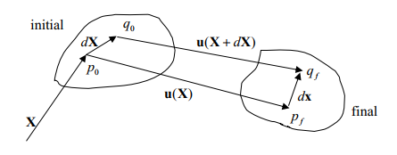
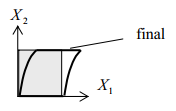

# 0. 目录

[TOC]

这里我们对向量场的微分和积分进行进一步的推广。

# 1. 向量场

## 1.1 向量场的梯度

梯度是斜率从一维到三维的推广。

考虑向量场函数 $\pmb{u}=\pmb{u}(\pmb{x})$ 的微小变化 $d\pmb{u}$，有：
$$
\begin{align}
d\pmb{u} 
& = \frac{\partial u_i\pmb{e}_i}{\partial x_j} dx_j 
= \frac{\partial u_i}{\partial x_j} dx_j \pmb{e}_i 
= \frac{\partial u_i}{\partial x_j} dx_k \pmb{e}_i(\pmb{e}_j \cdot \pmb{e}_k) \\
\\
& = \frac{\partial u_i}{\partial x_j} dx_k (\pmb{e}_i \otimes \pmb{e}_j) \pmb{e}_k \\
\\
& = \frac{\partial u_i}{\partial x_j}  (\pmb{e}_i \otimes \pmb{e}_j) dx_k \pmb{e}_k \\
\\ & \stackrel{!}{=}
grad(\pmb{u}) d\pmb{x} \\
\\

\Rightarrow \quad 
grad(\pmb{u}) 
& = \frac{\partial u_i}{\partial x_j}  (\pmb{e}_i \otimes \pmb{e}_j)
= \frac{d\pmb{u}}{d\pmb{x}}
\end{align}
$$
我们也可以使用 Nabla 算子来定义梯度，有多种方式：

- 直接定义，得到我们这里的梯度的转置，有：
  $$
  \nabla \otimes \pmb{u} 
  = \frac{\partial}{\partial x_i}\pmb{e}_i \otimes u_j \pmb{e}_j 
  =  \frac{\partial u_j}{\partial x_i}\pmb{e}_i \otimes \pmb{e}_j
  = \Big( grad(\pmb{u})\Big)^T
  $$
  虽然也有把这个定义为梯度的，但是为了区分，我们记它为 $\nabla \otimes \pmb{u}$ 

- 用转置的方法定义：
  $$
  grad(\pmb{u}) = (\nabla \otimes \pmb{u})^T
  $$

- 改变 Nabla 算符的意义，不再是按顺序乘，而是把算符的对象包进去，有：
  $$
  \nabla \otimes (\bullet) 
  = \frac{\partial (\bullet)}{\partial x_i} \otimes \pmb{e}_i 
  = grad(\bullet)
  $$


### 向量场梯度的物理意义

某向量场的梯度是一个线性变换，它做了一个什么事呢，让我们具体来看一看。

让我们用 MatLab 画出二维向量场 $\pmb{u} = (2x_1 + x_2)\pmb{e}_1+(x_1-x_2)\pmb{e}_2$ 的图像

```matlab
[x,y] = meshgrid(-5:1:5,-5:1:5);
u = 2*x+y;
v = x-y;
figure
quiver(x,y,u,v)
```


其梯度为：

$$
grad (\pmb{u}) 
= \begin{pmatrix}
\frac{\partial u_1}{\partial x_1} & \frac{\partial u_1}{\partial x_2} \\
\frac{\partial u_2}{\partial x_1} & \frac{\partial u_2}{\partial x_2} \\
\end{pmatrix}
= \begin{pmatrix}
2 & 1 \\
1 & -1 \\
\end{pmatrix}
$$
让我们取向量场中任意一点的位置向量，如：
$$
\pmb{p}=\begin{pmatrix} p_1 \\ p_2\end{pmatrix} = \begin{pmatrix} 4 \\ 3\end{pmatrix}
$$

这个位置向量的单位向量为

$$
\pmb{e}_p =\frac{\pmb{p}}{|\pmb{p}|} = \frac{1}{\sqrt{p_1^2+p_2^2}} \cdot \begin{pmatrix}p_1 \\ p_2 \end{pmatrix} = \begin{pmatrix} 4/5 \\ 3/5\end{pmatrix} 
$$

用这个梯度对这个单位向量做变换，有：
$$
grad (\pmb{u}) [\pmb{e}_p]
= \begin{pmatrix} 2 & 1 \\ 1 & -1 \\ \end{pmatrix} 
\begin{pmatrix} 4/5 \\ 3/5 \\ \end{pmatrix}
= \begin{pmatrix} 11/5 \\ 1/5 \\ \end{pmatrix}
$$
其正好就是向量场在点 $\pmb{P}$ 的向量值！

*可以看出，向量场的梯度这一张量在计算的时候，就正好把向量场的在各个坐标轴的分量剥离出来，再重新组合成新的张量*。

*用这个张量对某方向上的单位向量做变换，显然就是将这个单位向量按照这个向量场做拉伸、缩放，便会得到向量场中某点的向量。*

==总之，向量场的张量一个线性变换，你给它一个场里的一个点的位置向量，它便会告诉你，这个点对应的地方的向量是多少。==

感觉脱裤子放屁。

### **变形梯度**

Deformation Gradient

变形梯度，是 “向量场的梯度” 这一数学概念在连续体力学中最重要的应用。

> 考虑某初始构型中的两点 $p_0$ 和 $q_0$ 
>
> 在初始时刻
>
> - $p_0$ 的位置向量为 $\pmb{X}$ (使用大写的 $\pmb{X}$ 是一种惯例）
> - $q_0$ 的位置是是 $\pmb{X}+d\pmb{X}$
>
> 物体经过变形，获得了新的构型；在对应的终止构型中，同样的两点，称作 $p_f$ 和 $q_f$ 
>
> 对应的质点位移向量为：
>
> - $p_0 \to p_f: \pmb{u}=\pmb{u}(\pmb{X})$
> - $q_0 \to q_f: \pmb{u}=\pmb{u}(\pmb{X}+d\pmb{X})$
>
> 有图：
>
> 
>
> 一个物体的变形，即两点之间距离的变化，有：$ d\pmb{x} - d\pmb{X} $
>
> 根据向量加减法，有：
> $$
> \begin{align}
> \Big( d\pmb{X} + \pmb{u}(\pmb{X}+d\pmb{X}) \Big) - \pmb{u}(\pmb{X}) 
> & = d\pmb{x} \\
> \\
> \Rightarrow \quad 
> d\pmb{x} & = d\pmb{X} + d\pmb{u}(\pmb{X})\\
> 
> \end{align}
> $$
> 由向量场的梯度：
> $$
> grad(\pmb{u}) 
>  = \frac{\partial u_i}{\partial X_j}  (\pmb{e}_i \otimes \pmb{e}_j)
> = \frac{d\pmb{u}}{d\pmb{X}}
> $$
> 可得：
> $$
> d\pmb{x}  = d\pmb{X} +  \underbrace{grad(\pmb{u}) [d\pmb{X}]}_{变形量}
> $$
>

位移场的梯度，对未变形体的线元做的变换，得到的线元，就是物体的变形。

变形梯度并不能刻画物体在空间中是怎么位移的。

#### 例：二维矩形微元的变形

> 有一个矩形微元，能代表其大小的微元向量为：
> $$
> d\pmb{X} = dX_i \pmb{e}_i 
> = \begin{pmatrix} dX_1 \\ dX_2 \end{pmatrix}
> $$
> 其处于位移场 
> $$
> \pmb{u} = \pmb{u}(\pmb{X}) 
> = \begin{pmatrix}
> kX_2^2 \\ 0
> \end{pmatrix}
> $$
> 中
>
> 则变形后，它的大小变为：
> $$
> \begin{align}
> d\pmb{x} & = d\pmb{X} + grad(\pmb{u}) [d\pmb{X}] \\
> \\
> & = 
>  \begin{pmatrix} dX_1 \\ dX_2 \end{pmatrix}
> + \begin{pmatrix}
> \frac{\partial u_1}{\partial X_1} & \frac{\partial u_1}{\partial X_2} \\
> \frac{\partial u_2}{\partial X_1} & \frac{\partial u_2}{\partial X_2} \\
> \end{pmatrix}
>  \begin{pmatrix} dX_1 \\ dX_2 \end{pmatrix}\\
> \\
> & =
>  \begin{pmatrix} dX_1 \\ dX_2 \end{pmatrix} 
>  + \begin{pmatrix}
> 0 & 2kX_2\\
> 0 & 0 \\
> \end{pmatrix}
>  \begin{pmatrix} dX_1 \\ dX_2 \end{pmatrix} \\
>  \\
>  & = 
>   \begin{pmatrix} dX_1+2kX_2dX_1 \\ dX_2 \end{pmatrix} 
> \end{align}
> $$
> 只在 $X_1$ 方向上变形了
>
> 

## 1.3 向量场的散度和旋度

向量场的散度和旋度我们已经讨论过了。

# 2. 张量场的计算

## 2.1  ${d\pmb{T}(t)}/{dt}$

张量函数的微分结果仍然是张量。

微分的定义：
$$
\frac{d\pmb{T}(t)}{dt}
= \lim\limits_{\Delta t \to 0} 
\frac{\pmb{T}(t+\Delta t) - \pmb{T}(t)}{\Delta t}
$$
微分的简明计算：
$$
\frac{d\pmb{T}(t)}{dt} 
= \frac{T_{ij}(t)}{dt} \pmb{e}_i \otimes \pmb{e}_j
$$
由于定义相同，故张量函数的微分计算法则仍然和一般的微分法则一致。

注意要保证被微分对象之间的顺序，有：

- $\frac{d}{dt}(\pmb{T}_1+\pmb{T}_2) = \frac{d}{dt}\pmb{T}_1 + \frac{d}{dt}\pmb{T}_2$
- $\frac{d}{dt}\big( \alpha(t)\pmb{T} \big) = \alpha(t)\frac{d\pmb{T}}{dt}+ \frac{d\alpha(t)}{dt}\pmb{T}$
- $\frac{d}{dt}(\pmb{T} \pmb{a}) = \pmb{T}\frac{d\pmb{a}}{dt} + \frac{d\pmb{T}}{dt}\pmb{a}$
- $\frac{d}{dt}(\pmb{T}_1 \pmb{T}_2) = \pmb{T}_1\frac{d\pmb{T}_2}{dt} + \frac{d\pmb{T}_1}{dt}\pmb{T}_2$
- $\frac{d}{dt}(\pmb{T}^T) = (\frac{d\pmb{T}}{dt})^T$

## 2.2 张量场的梯度

二阶张量场的梯度是三阶张量场

张量场的梯度定义参照向量场，有：
$$
grad(\pmb{T}) 
= \frac{\partial \pmb{T}}{\partial \pmb{x}} 
= \frac{\partial T_{ij}}{\partial x_k} \pmb{e}_i \otimes \pmb{e}_j \otimes \pmb{e}_k
$$
张量场的梯度可以使用 Nabla 算子进行描述，获得另一种定义的梯度，有：
$$
\begin{align}
grad(\pmb{T}) \neq \nabla \otimes \pmb{T} 
& = \frac{\partial}{\partial x_i} \pmb{e}_i \otimes T_{jk} \pmb{e}_j\otimes \pmb{e}_k \\
\\
& = \frac{\partial T_{jk}}{\partial x_i} \pmb{e}_i \otimes \pmb{e}_j \otimes \pmb{e}_k 
\end{align}
$$

## 2.3 张量场的散度

二阶张量场的散度是一阶张量场。

张量场的散度定义参照向量场，有：
$$
\begin{align}
div (\pmb{T}) = grad(\pmb{T}) : \pmb{I}
& = \frac{\partial T_{ij}}{\partial x_k} (\pmb{e}_i \otimes \pmb{e}_j \otimes \pmb{e}_k )
: \delta_{pq} (\pmb{e}_p \otimes \pmb{e}_q) \\
\\
& = \frac{\partial T_{ij}}{\partial x_k} \delta_{pq} 
(\pmb{e}_j\cdot\pmb{e}_p) (\pmb{e}_k\cdot\pmb{e}_q) \pmb{e}_i \\
\\
& = \frac{\partial T_{ij}}{\partial x_j}  \pmb{e}_i \\ 

\end{align}
$$

张量场的散度可以使用 Nabla 算子进行描述，获得另一种定义的散度：
$$
\begin{align}
div (\pmb{T}) \neq \nabla \cdot \pmb{T}
& =  \frac{\partial}{\partial x_i} \pmb{e}_i \cdot T_{jk} \pmb{e}_j \otimes \pmb{e}_k \\
\\ 
& = \frac{\partial T_{jk}}{\partial x_i} (\pmb{e}_i\cdot\pmb{e}_j)\pmb{e}_k \\
\\
& = \frac{\partial T_{ji}}{\partial x_j}\pmb{e}_i
\end{align}
$$

也有人改变了 Nabla 算符的意义，不再是按顺序乘，而是把算符的对象包进去，有：
$$
\nabla \cdot (\bullet) 
= \frac{\partial (\bullet)}{\partial x_i} \cdot \pmb{e}_i 
= div(\bullet)
$$

### 散度定理

The Divergence Theorem

高斯散度定理可以从向量场推广至更高阶的张量场。

>高斯散度定理 the divergence theorem of Gauss 是最重要的积分定理。
>
>联系了三维物体的面积分和体积分。
>
>对处于向量场 $$\pmb{v}(\pmb{x},t)$$ 的物体 $$\mathcal{B}$$ ，其体积为 $$V$$ ，表面积为 $$S$$ ，表面外法向量为 $$\pmb{n}(\pmb{x})$$ ，有：
>$$
>\int_S \pmb{v} \cdot \pmb{n}dS
>= \int_V div (\pmb{v})dV \\
>$$
>该定理有三个推论：
>$$
>\begin{align}
>1. &\  \int_S \phi \pmb{u} \cdot \pmb{n}dS=\int_V div(\phi \pmb{u})dV \\
>2. &\  \int_S \phi \pmb{n}dS = \int_V \underline{grad} (\phi) dV \\
>3. &\  \int_S \pmb{n} \times \pmb{u}dS = \int_V \underline{curl}(\pmb{u})dV
>\end{align}
>$$
>对一个很小的体积来说，有：
>$$
>div(\pmb{v}) = 
>\frac{\int_S \pmb{v}\cdot \pmb{n}dS}
>{\lim\limits_{V\to0} V}
>$$
>所以高斯散度定理说的是，向量场的散度，等于，其中的物体，其每单位体积表面积的通量。

一个处于三维空间的 $n$ 阶张量场 $\pmb{T}^{(n)}=\pmb{T}^{(n)}(\pmb{x},t)$ ，其分量为 $T_{\underbrace{abc...n}_{n}}$

对处于该张量场的物体 $$\mathcal{B}$$ ，其体积为 $$V$$ ，表面积为 $$S$$ ，表面外法向量为 $$\pmb{n}(\pmb{x})$$ ，有：
$$
\int_S \pmb{T}^{(n)} \cdot \pmb{n}dS
= \int_V div (\pmb{T}^{(n)})dV \\
$$
对于二阶张量来说，有：
$$
\begin{align}
\int_S \pmb{T} \cdot \pmb{n}dS
& = \int_V div (\pmb{T})dV \\
\\
\int_S T_{ij}n_jdS 
& = \int_V \frac{\partial T_{ij}}{\partial x_j}dV
\end{align}
$$
该定理也有三个推论
$$
\begin{align}
1. &\  \int_S (\phi \pmb{T})\pmb{n}dS=\int_V div(\phi \pmb{T})dV \\
2. &\  \int_S \pmb{u}\otimes\pmb{n}dS = \int_V grad(\pmb{u}) dV \\
3. &\  \int_S \pmb{u} \cdot \pmb{T}\pmb{n}dS = \int_V div(\pmb{T}^T\pmb{u})dV
\end{align}
$$


## 2.4 张量场的旋度

好像不太需要考虑。

## 2.5 张量场的性质

---

$grad(\phi \pmb{v}) = \phi grad(\pmb{v})+\pmb{v} \otimes grad(\phi)$

$grad(\pmb{u} \cdot \pmb{v}) = \Big( grad(\pmb{u}) \Big)^T \pmb{v} +  \Big( grad(\pmb{v}) \Big)^T \pmb{u}$

$div (\pmb{u} \otimes \pmb{v}) = \Big( grad(\pmb{u}) \Big) \pmb{v} + \Big( div(\pmb{v})\Big)\pmb{u}$

$curl (\pmb{u} \times \pmb{v}) = \pmb{u} div(\pmb{v}) - \pmb{v} div (\pmb{u}) + grad(\pmb{u})\pmb{v} - grad(\pmb{v})\pmb{u}$

---

$div(\phi\pmb{T}) = \pmb{T} grad (\phi) + \phi div(\pmb{T})$

$div(\pmb{T}\pmb{u})=\pmb{u}\cdot div(\pmb{T}^T)+tr\Big(\pmb{A}grad(\pmb{u})\Big)$

$div(\pmb{A}\pmb{B})=\pmb{A}div(\pmb{B})+grad(\pmb{A}):\pmb{B}$

$div\Big(\pmb{A}(\phi\pmb{B})\Big)=\phi div(\pmb{A}\pmb{B})+\pmb{A}\Big(\pmb{B}grad(\phi)\Big)$

$grad(\phi\pmb{A})=\phi grad(\pmb{A})+\pmb{A}\otimes grad(\phi)$

---

$\nabla^2(\pmb{a}\cdot\pmb{b})=\nabla^2\pmb{a}\cdot\pmb{b}+2grad(\pmb{a}):grad(\pmb{b})+\pmb{u}\cdot\nabla^2\pmb{b}$

$curl\Big(curl(\pmb{u})\Big)=grad\Big(div(\pmb{u})\Big)-\nabla^2\pmb{u}$

