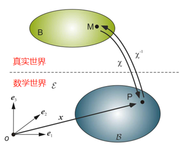
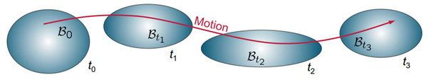
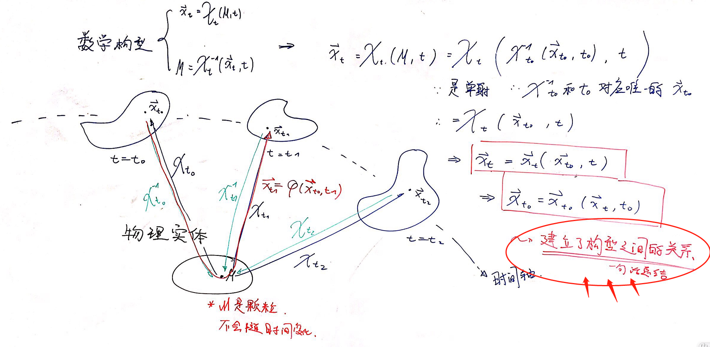

# 目录

[TOC]

# 1. 一些基本概念

## 1.1 研究原则

我们不讨论真实的物体 Physical Entity。

我们只讨论真实物体在抽象世界中投影，称作 Body。

一个 Body 应该有一些连续的性质，即连续的函数。

一个和真实世界比较接近的抽象世界是欧几里得空间。

我们讨论在欧几里得空间中的 Body。

我们用抽象空间中的位置向量，来描摹这个 Body。

通过研究这些向量的性质，来研究物体的性质。

---

## 1.2 构型和运动

在真实世界和抽象世界之间，我们可以定义出一个映射 $\chi$ 联系物理世界和数学世界，有：
$$
\begin{align}
\pmb{x} & = \chi(M)  := 构型\\
\\
M & = \chi^{-1} (\pmb{x})
\end{align}
$$
严格地说，这个映射 $\chi$ ；不严格地说，这个映射的对象 $\pmb{x}$ ，就称作构型。

构型在时间上的变化，构成的类 family，称作这个 Body 的运动 Motion。
$$
\begin{align}
\pmb{x} & = \chi(M,t )  := 运动\\
\\
M & = \chi^{-1} (\pmb{x},t)
\end{align}
$$

---

## 1.3 参考构型和即时构型

由于运动是相对的，所以我们需要一个参考构型，来描述运动。

一般地，可以任意选择 $t=t_0$ 时的构型，作为参考构型。

>  我们可以选择 $t=0$ 时的 Initial Configuration；也可以选择内部无应力的 Undeformed Configuration。

在一段时间之后，在 $t$ 时刻，Body 运动到了我们需要研究的这么一个构型，即 Current Configuration。

通过物理实体这么一个中间媒介，我们可以建立即时构型和参考构型之间的映射。

