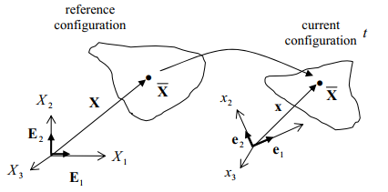
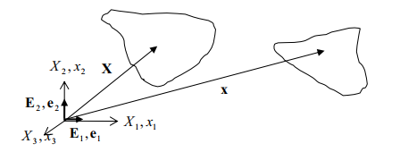
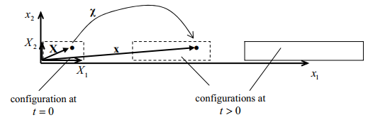
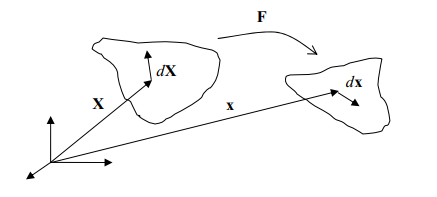

# 目录

[TOC]

# 一些基本概念

## 研究原则

我们不讨论真实的物体 Physical Entity。

我们只讨论真实物体在抽象世界中投影，称作 Body。

一个 Body 应该有一些连续的性质，即这些性质是连续的函数。

一个比较容易接近我们平时生活的抽象世界是欧几里得空间。

我们讨论在欧几里得空间中的 Body。

我们用抽象空间中的位置向量，来描摹这个 Body。

通过研究这些向量的性质，来研究物体的性质。

## 构型和运动

在真实世界和抽象世界之间，我们可以定义出一个映射 $\chi$ 联系物理世界（M：Matter）和数学世界，有：
$$
\begin{align}
\chi&:  M\mapsto \pmb{x} \\
\\
\pmb{x} & = \chi(M)  := 构型\\
\\
M & = \chi^{-1} (\pmb{x})
\end{align}
$$
严格地说，这个映射 $\chi$ ；不严格地说，这个映射的对象 $\pmb{x}$ ，就称作构型。

构型在时间上的变化，构成的类 family，称作这个 Body 的运动 Motion。
$$
\begin{align}
\pmb{x} & = \chi(M,t )  := 运动\\
\\
M & = \chi^{-1} (\pmb{x},t)
\end{align}
$$

---

## 参考构型和即时构型

由于运动是相对的，所以我们需要一个参考构型，来描述其他运动。

一般地，可以任意选择 $t=t_0​$ 时的构型，作为参考构型。

>  我们可以选择 $t=0$ 时的 Initial Configuration
>
>  也可以选择内部无应力的 Undeformed Configuration

在一段时间之后，在 $t$ 时刻，Body 运动到了我们需要研究的这么一个构型，即 Current Configuration。

通过物理实体这么一个中间媒介，我们可以建立即时构型和参考构型之间的映射。

关键在于，构型之间是无法直接建立映射的，必须通过物理实体这么一个中间媒介，才可以建立映射。

要注意的是，在不同时间，可以用不同的坐标系描述物质点。也就是说，$\vec{x}_{t_{0}}$ 和 $\vec{x}_{t_{1}}$ 可以是不同的坐标系，如：

但是在实践中，我们经常还是使用同一个，虽然有时候使用不同的坐标系会有它的用处。

由于运动是相对的，我们既可以站在 $\pmb{X}$ 上看 $\pmb{x}$（参考系不动）；也可以站在 $\pmb{x}$ 上看 $\pmb{X}$（参考系运动）。

我们可以基于一个不动的参考系，描述某研究对象的运动（拉格朗日 is a stalker）

我们也可以

参考系不动的考察方式，称作拉格朗日描述；参考系运动的考察方式，称作欧拉描述。

- 拉格朗日描述：$\pmb{x}=\pmb{x}(\pmb{X},t)$
- 欧拉描述：$\pmb{X}=\pmb{X}(\pmb{x}(t),t)$

这两种描述方式在描述小变形时没有区别，在描述有限变形时区别较大。

两者最大的区别体现在对时间求导的时候。

为了说明这两者的关系和区别，我们引入两个例子：

### 例1：位移、速度和加速度

>位移向量，是位置向量的差，有：
>$$
>\pmb{u}=\pmb{x}-\pmb{X}
>$$
>使用固定参考系（拉格朗日描述），有：
>
>- 位移 ：$ \pmb{u}=\pmb{x}(\pmb{X},t)-\pmb{X}$
>- 速度：$\pmb{v}=\dot{\pmb{u}}=\frac{d\big(\pmb{x(\pmb{X},t})-\pmb{X}\big)}{dt}=\dot{\pmb{x}}$
>- 加速度：$\pmb{a}=\dot{\pmb{v}}=\ddot{\pmb{x}}$
>
>使用运动参考系（欧拉描述），有：
>
>- 位移：$\pmb{u}=\pmb{x}(t)-\pmb{X}(\pmb{x}(t),t)=\pmb{u}\big(\pmb{x}(t),t\big)$
>- 速度：$\pmb{v}=\dot{\pmb{u}}=\frac{d\pmb{u}\big(\pmb{x}(t),t\big)}{dt}=\frac{\partial\pmb{u}\big(\pmb{x}(t),t\big)}{\partial\pmb{x}(t)}\cdot\frac{d\pmb{x}(t)}{dt}+\frac{\partial\pmb{u}\big(\pmb{x}(t),t\big)}{\partial t}\cdot\frac{dt}{dt}=grad(\pmb{x})\cdot\dot{\pmb{x}}+\frac{\partial\pmb{u}}{\partial t}$
>- 加速度：$\pmb{a}=\frac{d\pmb{v}}{dt} = grad(\pmb{v})\cdot\dot{\pmb{x}}+\frac{\partial\pmb{v}}{\partial t}$

### 例2：杆的运动

>使用固定参考系（拉格朗日描述），有：
>- $$ \pmb{x} = \pmb{x}(\pmb{X},t) =  \begin{pmatrix}  x_1(\pmb{X},t) \\ x_2(\pmb{X},t) \\ x_3(\pmb{X},t) \end{pmatrix}  =  \begin{pmatrix}  3X_1 t+X_1+t \\ X_2 \\ X_3  \end{pmatrix} $$
>- 拉格朗日告诉我们，$t=0$ 时，原位置是 $\pmb{X}$ 的点，现在处于位置  $\pmb{x}$。
>
>我们可以很容易得到反过来的关系。
>
>使用运动参考系（欧拉描述），有：
>- $$ \pmb{X} = \pmb{X}(\pmb{x},t) = \begin{pmatrix} \frac{x_1-t}{1+3t} \\ x_2 \\ x_3  \end{pmatrix} $$
>- 欧拉告诉我们，$t$ 时刻，处于  $\pmb{x}$ 的点，其原位置 $\pmb{X}$

# 变形和应变

## 变形梯度

我们通过物理实体建立了不同构型之间的映射，即：

- 拉格朗日描述：$\pmb{x}=\pmb{x}(\pmb{X},t)$
- 欧拉描述：$\pmb{X}=\pmb{X}(\pmb{x}(t),t)$

对拉格朗日描述的映射 $$ \chi: \pmb{X} \mapsto \pmb{x}(\pmb{X}）$$ 可以使用泰勒级数，对拉格朗日描述 $\pmb{x}(\pmb{X}+d\pmb{X})$ 展开。

在忽略小量的情况下，我们可以得到变形梯度张量场。

有：

$$
\begin{align}
\pmb{x}(\pmb{X}+d\pmb{X}) 
& = \pmb{x}(\pmb{X}) + \frac{d\pmb{x}(\pmb{X})}{d\pmb{X}}\cdot \big( (\pmb{X}+d\pmb{X})-\pmb{X} \big) + \underbrace{...}_{高阶小量} \\
\\
& = \pmb{x}(\pmb{X})+ d\pmb{x}(\pmb{X}) \\
\\
& = \pmb{x}(\pmb{X}) + \frac{\partial x_i}{\partial X_j} \pmb{e}_i \otimes \pmb{e}_j \cdot dX_k \pmb{e}_k\\
\\
& = \pmb{x}(\pmb{X}) + d\pmb{x}(\pmb{X}) \\
\\
\Rightarrow d\pmb{x}(\pmb{X})
& =   grad(\pmb{x}) \cdot d\pmb{X}
\end{align}
$$

在拉格朗日描述下 $d\pmb{u}=d\pmb{x}$，于是对变形梯度 $\pmb{F}$，有：
$$
\pmb{F}=grad(\pmb{u})=\frac{d\pmb{u}}{d\pmb{X}}=\frac{d\pmb{x}}{d\pmb{X}}=\frac{\partial x_i}{\partial X_j} \pmb{e}_i\otimes\pmb{e}_j
$$

注意，变形梯度的推导决定了，它是存在误差的。

变形梯度描述了某个点周围的变形情况。

### 均匀变形

Homogeneous Deformations

大小、方向一致的变形梯度张量场，造成的变形为均匀变形。

物质的每一块都与整体有一样的变形。

线元与线元之间的相对关系，在经过映射后不发生改变。

参考构型中的平行直线线元，经过变形梯度张量场，映射为同样平行的线元。

大部分的基础实验（如，单轴拉伸实验）涉及到的变形是均匀变形。

均匀变形在数学上的处理也很方便。

### 刚体转动和平动

Rigid Body Rotation and Translations

我们可以给运动向量场 $\pmb{u}=\pmb{x}$ 再加上一段平动向量 $\pmb{c}$

但是，变形梯度并不会改变：$grad(\pmb{x}+\pmb{c})=grad(\pmb{x})$ 

所以，有：

- 平动的刚体：$\pmb{F}=\pmb{I}, \pmb{x}=\pmb{I}(\pmb{X})+\pmb{c}$
- 转动的刚体：$\pmb{F}=\pmb{R}, \pmb{x}=\pmb{R}(\pmb{X})$

### 变形梯度张量的逆

对由即时构型到参考构型的映射，即变形的逆映射 $$\chi^{-1} : \pmb{x} \mapsto \pmb{X}(\pmb{x})$$ 也可以作泰勒展开，有：
$$
\begin{align}
\pmb{X}(\pmb{x}+d\pmb{x}) 
& = \pmb{X}(\pmb{x}) + \frac{d\pmb{X}(\pmb{x})}{d\pmb{x}}\cdot \big( (\pmb{x}+d\pmb{x})-\pmb{x} \big) + \underbrace{...}_{高阶小量} \\
\\
& = \pmb{X}(\pmb{x})+ d\pmb{X}(\pmb{x}) \\
\\
& = \pmb{X}(\pmb{x}) + \frac{\partial X_i}{\partial x_j} \pmb{e}_i \otimes \pmb{e}_j \cdot dx_k \pmb{e}_k\\
\\
\Rightarrow d\pmb{X}(\pmb{x})
& =   \pmb{F}^{-1} \cdot d\pmb{x}
\end{align}
$$

### 例：变形梯度和它的逆

某变形，即映射 $$ \chi: \pmb{X} \mapsto \pmb{x}(\pmb{X}）$$，在物质坐标系下，有：
$$
\pmb{x} = \pmb{x}(\pmb{X}) = 
\begin{pmatrix}
2X_1- 2X_3 \\ -X_2 \\ X_1 + 3X_2 + X_3
\end{pmatrix}
$$
我们可以通过列方程组，得到其逆映射 $$\chi^{-1} : \pmb{x} \mapsto \pmb{X}(\pmb{x})$$ 在同一个坐标系下的表示，有：
$$
\pmb{X} = \pmb{X}(\pmb{x}) = 
\begin{pmatrix}
x_1 + 5x_2 + x_3 \\ -x_2 \\ -x_1 -2x_2
\end{pmatrix}
$$
对于这样一个向量场，