# 0. 引言

我们大部分人都会遇到下面这几种情况：

- 工作中需要整理各种文件资料，但一时半会儿却*抓不住重点内容*
- 每天被大量的资讯信息占据了几乎所有的时间，本以为时时都在成长，但一天下来回望自己，好像也*没记住些什么*
- 遇到比较复杂的事情，比如你需要举办一场活动或聚会，但*不知道从何处着手*
- 要处理跨部门的问题矛盾，却*找不到最佳的解决办法*

我以前的生活也和你一样，有着上述的困惑。

在寻求解决方案的道路上，我遇到了思维导图，它可以帮助我解决生活工作中遇到的各种难题。

它是一个通用工具，毫不夸张地说，**它是目前世界上最为前沿的可视化记录技术**。

## 我的经历

我在上学的时候读到了一本书叫《学习的革命》。这本书中提到的思维导图的方法，完全颠覆了我当时对于学习的认知。

我们在日常工作和学习时，最常用的笔记方式是像1、2、3、4这样的直线型方式，但“思维导图”方法认为，这其实违反了思维的本来面目，也阻碍了思维的效率。

“思维导图”方法的核心思想就是**把形象思维与抽象思维很好地结合起来，让你的左右脑同时运作，将你的思维痕迹在纸上用图画和线条形成发散性的结构。**

于是我开始摸索着尝试使用思维导图的方式来梳理自己的工作生活。

毕业之后，我在电台做主持人，期间需要编辑大量的稿子，我就用导图进行思路的梳理，梳理过的稿件逻辑清晰，主次分明，为我节省了很多编辑的时间。

要想成为一名合格的主持人需要进行普通话一级甲等考试，那时我只有1星期的复习时间，于是我就**用思维导图将全部考点梳理到4张A4纸上，摒弃教材，对着这四张纸进行考前准备**。因为自己整理过的考点逻辑清晰，重点明确，记忆深刻，完全节省了我翻阅教材的时间，而且几乎不会出现记忆混淆的状况，最后，我在考试中取得了97.1分的好成绩，顺利考取了最高级别的证书“一级甲等证书”。

其实在这期间，对于思维导图，我是一直处于半自学的状态。因为喜欢，所以一直坚持，但我并不满足于此，到2014年，我远赴英国亨利商学院，向**思维导图的发明人东尼·博赞教授**专程学习思维导图。同年，我成为**中国大陆第一位获得博赞思维导图全球授权认证的女性注册导师**。

2016年，在新加坡举办的第八届世界思维导图锦标赛上，我打破了世界思维导图锦标赛举办以来三个比赛项目的所有成绩纪录，博赞教授亲自为我授予了“**思维导图世界总冠军**”的荣誉称号。

因为我本身是导图的受益者，为了让更多的人能够一起学习、应用思维导图，我放弃了主持人的工作，开启了我的思维导图教学之路。在长达10多年的教学中，我先后在国内培养了**近10万多名**学员。

之前我都是在线下课程发力，这次受“在行一点”的邀请来做线上课程，也是希望服务更多的用户，让思维导图帮助到更多的人。

## 为什么要学习手绘思维导图？

手绘思维导图的优势是**能够帮助我们有效地提高时间利用率**，只要有纸和笔，便可随时随地，轻松愉快，不受约束地拓展思维，整理思路。

我想，有很多人会有这样地疑问：我没有绘画基础，手绘会不会很慢，谈何高效呢？

接下来我将给大家解答这个疑惑。

1. 画图其实不是件难事，**只要你会画圆形、方形、三角形这三个基本图形就一定会画思维导图**，因为思维导图中的图像语言完全是由这三个基本图形组成的，而且一幅导图在什么情况下在哪里画图是有相关要求和出图原则的，图像只是用来辅助我们记忆重要内容的一个元素而已，并不是思维导图的核心，因此千万不要因为害怕画图这个问题而放弃学习**思维导图最核心的内容，——“思维方式”**。
2. 你在绘制导图时，**必须要边绘制边思考**，才能够真正把思维导图的逻辑架构呈现出来，所以这就节省了原本整理信息之后再进行思考的时间，一张图，画完了，也就思考好了，理解透了，记得住了，真正做到事半功倍。

总之，学会手绘思维导图，你将收获到的不仅仅是一种全新的思维模式和归纳技巧，更是一种你从未感受过的趣味高效生活，因为很多的学员表示画导图会上瘾！

## 课程内容和设计原理

在设计这门课程的时候，为了在21天里能够帮助大家更为系统完善的学习，我为本次课程设计了三大模块：

**第一，会画图；第二，会思考；第三，会应用。**

“画图”是学习导图的技术基础； “思考”是学习导图的底层逻辑； “应用”是学习导图的终极目标。

第一模块是“会画图”，我会先对**思维导图的中心图、颜色、线条、关键词、图像、结构六部分**进行一一讲解，然后，我会将六个部分结合起来告诉大家，画一幅完整的思维导图所需要的步骤。

第二模块是“会思考”，思维导图顾名思义是思维先行。**一幅高质量的思维导图必定是以“思维”为主导的**，所以在这个模块中，我会和你分享多种高效思考的方法，学会活用“思维架构”是切入问题核心的基础能力。

第三模块是“会应用”。学习思维导图最终的目的不是画出一幅惊艳的思维导图作品，而**最终目标是帮助你解决工作中的实际问题**，构建你的职场软实力，锻炼你的逻辑思考力，从而提高你的工作效率。

总的来说，**“会画图——会思考——会应用”是本次手绘思维导图训练营的核心教学目标**。

## 那么学完之后，你将收获到什么？

**第一，高实用、高颜值的思维导图**

通过本课程，你将学习到最正宗的思维导图，最新研发的国际思维导图绘制方法，而且你能够通过21天的学习，画出实用且高颜值的思维导图。

**第二，学习到透过现象看本质的思考方法**

你将开启一条良性循环之路，而**良性循环的关键之处就是“整理”和“激发”，这也是思维导图最强大的两个功能**。

说得再具体些，通过21天的训练，你可以把一本书的核心知识点放到一张图里，使知识结构更加系统化、规律化、整合化，好看又高效；

你可以看一眼就能记住内容要点，学会抓住重点，不管多复杂的内容，你都能简化它，三四年后还能清晰回忆起来；你可以用思维导图制作PPT，再多的信息和分支也不怕没有逻辑；

你可以用思维导图做时间管理和项目管理，工作轻松变得有条不紊。

手绘思维导图训练营，颠覆你的思维模式，开启高效记忆外脑，精炼冗长繁杂信息，倍速提高学习效率。

## 送给大家几点听课小建议

1.学习过程好比登山，路上必然会有困难，但我们把学习当做一个习惯来培养， 21天后，你一定可以达成目标。

2.我们这个课程前后打磨了近半年的时间，为大家呈现出来的是我十几年积累的导图经验。每一位同学只要静下心来跟我学，认真听课并且努力完成作业，21天后，你在导图方面一定会收获满满。

3.我们为你准备了【课前须知】和【课程福利】，周末更新，大家要记得详细看哦~

4.课程准备了精美海报，大家可以通过下图助教同学的示意，在每一节课程内容的最后，点击查看你学习了多少天，分享海报到朋友圈或你的好友中。

# 1. 如何阅读思维导图

今天是课程的第一天，我要和大家分享的主题是“阅读思维导图的方法”。也就是说教大家如何看懂一张思维导图。 

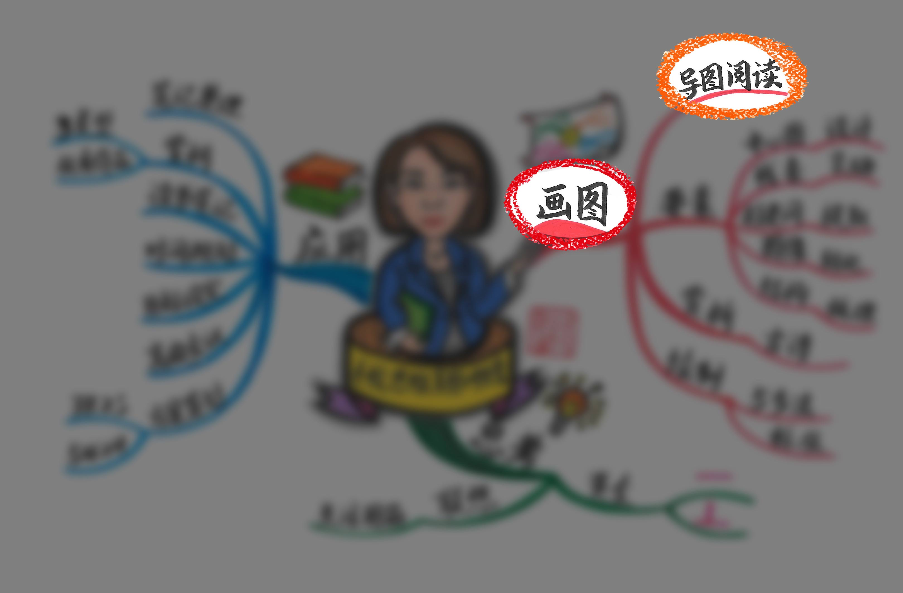 

不知你是否有过这样的经历，面对一张五颜六色的思维导图，有人会说非常漂亮、有人会说生动活泼，也有人会说看得我眼花缭乱，不知从何下手。

## 1.1 组成思维导图的 3 个部分

今天我就拿三年前画的一张思维导图和大家说一说，如何看懂一张思维导图。

如下图所示，一张标准的思维导图，包含三个重要的组成部分：

- 中心图（Central Image）
- 大纲主干（Main Branch）
- 内容分支（Sub Branch）

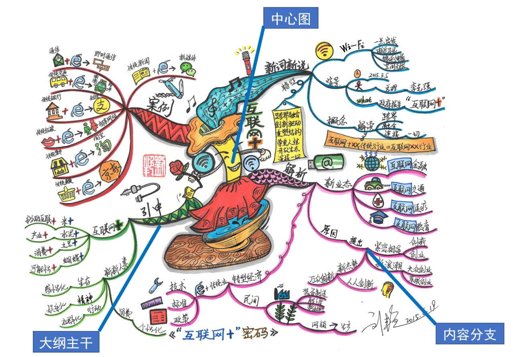 

首先，我们来认识一下这些专属名词。

- **中心图**：位于整张思维导图的中央，起到的是点明中心主题的作用，展现的是整张思维导图的主题，**中心图大约占整个纸张中央九分之一的位置**，是一个彩色的图，并且图文并茂，是整张思维导图中最明显、最大的图。
- **大纲主干**：也就是章节标题，又称基本分类概念（Basic Ordering Ideas），**是帮助我们进行内容分类的**。它连接着中心图，并且由中心图向外呈放射状形式延伸，是由粗到细的双线条，就像牛角一样。
- **内容分支：用来承载关键词，并且帮助我们引导视线，呈现内容关键词之间的逻辑关系**。连接在大纲主干之后，所有的线条均呈现出弯弯的、细细的单个弧线。

## 1.2 阅读思维导图的 6 个步骤

那么如何看懂一张思维导图？ 
我们分为六步阅读法。

1. 了解主题意象
2. 宏观整体架构
3. 掌握分类层次
4. 阅读细节内容
5. 强调关键插图
6. 重复重点内容

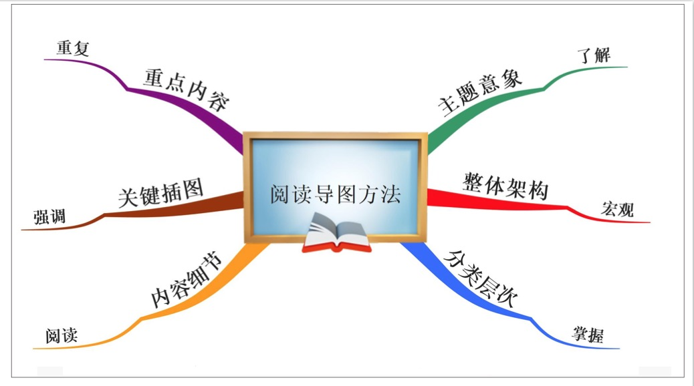 

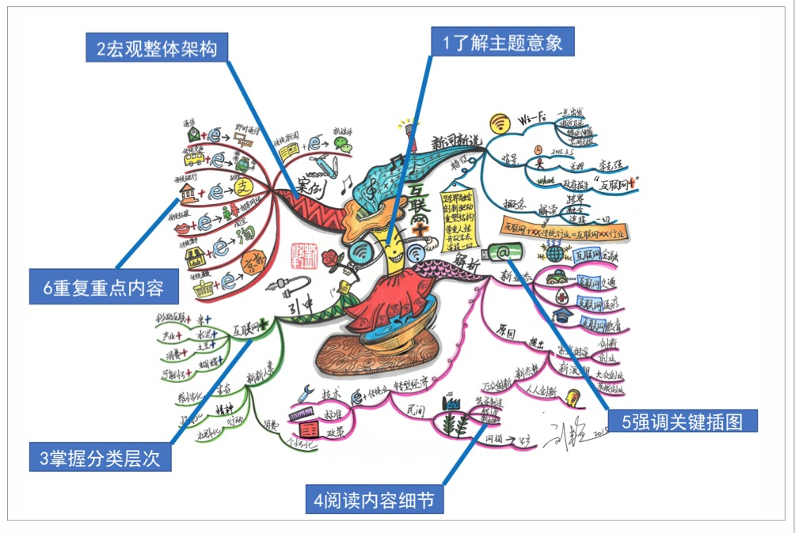 

我们逐一分解来看： 

### **了解主题意象**

阅读一张完整标准的思维导图，首先要从中心主题，即**中心图**开始，中心图会让我们对整张思维导图的主题有一个较为清晰的认识。

例如，下面这幅图的中心图是一个灵动的舞者，手持鲜花，两个手臂持续滚动“WIFI球”，她的头顶迸发出了一股装满“+++”与“音符”的源泉，同时也构成了第一部分的大纲主干。

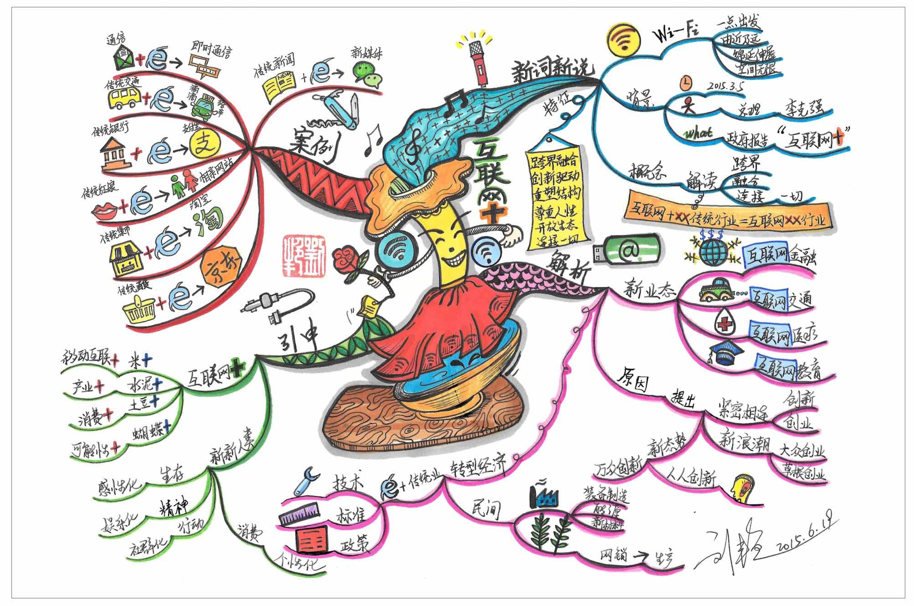 

整个中心图表现的就是舞者翘首企盼“互联网+”时代到来的喜悦心情。“互联网+”，指的就是互联网和传统行业、产业之间所做的加法，把互联网运用到传统产业当中去。 

### **宏观整体架构**

思维导图强调**见林也见树的模式，见林重于见树**，一张逻辑结构清晰的思维导图，大纲主干上的内容是最重要的，然后层层递进，越靠近中心图的内容重要性相对较高。

因此，我们从阅读所有大纲主干上的信息开始。首先从整幅导图**右上角的大纲主干开始，以顺时针方向依次阅读**各个大纲主干上的关键词内容，了解整幅思维导图的框架内容。

还是这张图：

 

例如第一个大纲主干讲的是“新词新说”， 
第二个大纲主干讲的是“解析”， 
第三个大纲主干讲的是“引申”， 
第四个大纲主干讲的是“案例”。

### **掌握分类层次**

然后分别阅读各个“大纲主干”之后的“内容分支”，尤其是“二级分支”。例如新词新说包含WIFI的含义、背景、概念、特征。

### **阅读内容细节**

接着逐一阅读小类别，也就是三级分支、四级分支以及细节描述的部分；

⑴ **第一个大纲主干：新词新说。**后面分为四个二级分支，分别是WIFI符号含义、背景、概念、特征。

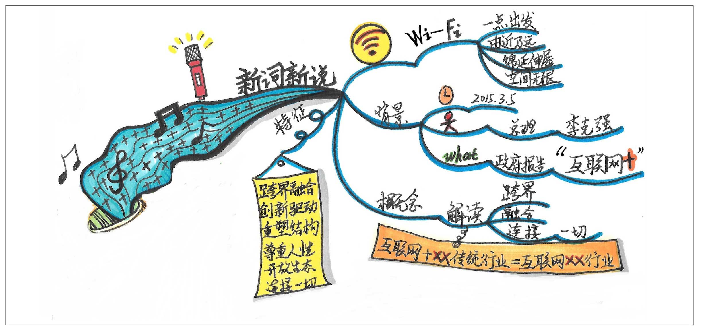 

提起“互联网+”，脑海中不由得呈现出一个扇形的WIFI符号，**寓意由一点出发，由近及远，绵延伸展，空间无限**。

**背景方面**，时间是2015年3月5号，人物是李克强总理，“what”事件是在政府工作报告中首次提出了“互联网+”的概念，概念指的就是“互联网+ XX传统行业=互联网XX行业，需要跨界、融合、连接一切。

它的特征是跨界融合、创新驱动、重塑结构、尊重人性、开放生态和连接一切。

⑵ **第二个大纲主干：解析。**后面分为三个内容分支，分别是新业态、提出的原因、转型经济。

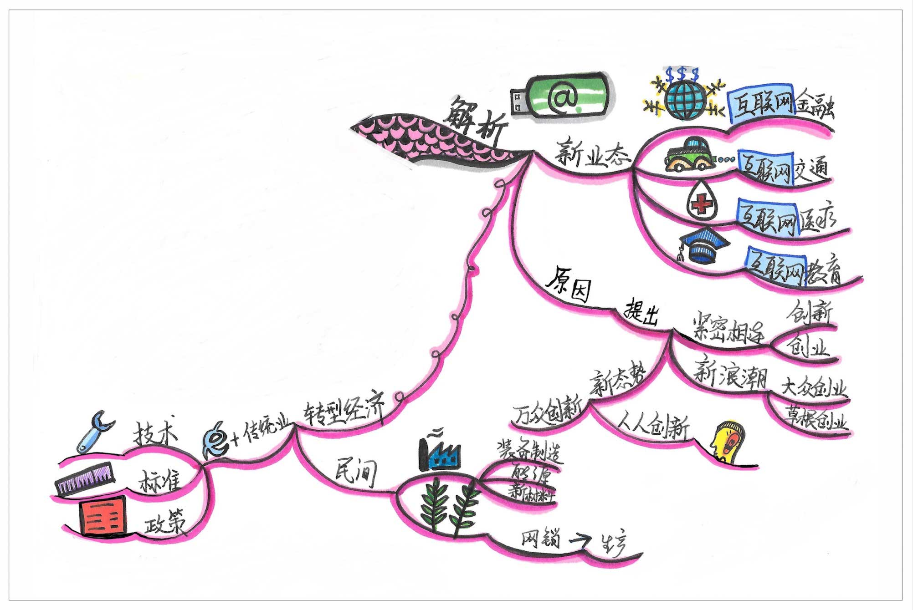 

近年来，“互联网+”模式，从全面应用到第三产业，形成了诸如：互联网金融、互联网交通、互联网医疗、互联网教育等新业态。

国家之所以提出“制定‘互联网+’行动计划”，原因就是因为它和“创新、创业”紧密相连，国家希望掀起“大众创业”、“草根创业”的新浪潮，形成“万众创新”、“人人创新”的新态势。

转型经济方面，互联网与传统行业在技术、标准、政策等多个方面充分对接，在民间，工业互联网正在从消费品工业向装备制造、能源和新材料等工业领域渗透，农业互联网也在从电子商务等网络销售环节向生产领域渗透。

⑶ **第三个大纲主干：引申。**后面分为两个内容分支，分别是互联网+、新新人类。

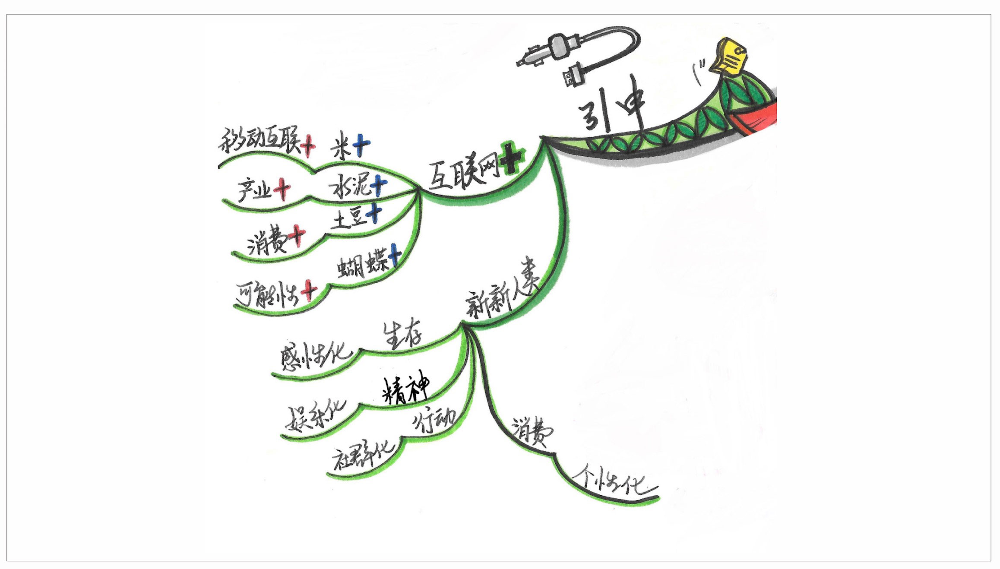 

在这里新新人类指的是80、90、00后，他们拉帮结派，他们感性化生存、娱乐化精神、社群化行动、个性化消费。

⑷ **第四个大纲主干：案例。**

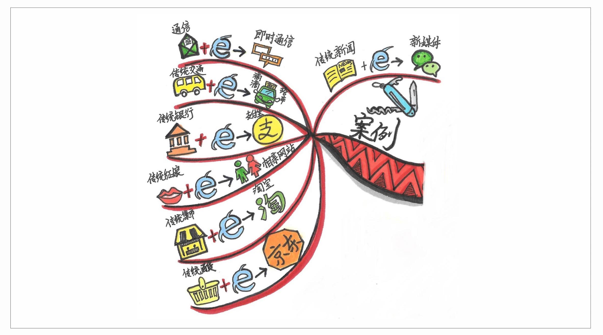 

后面分为七个内容分支，传统新闻+互联网=新媒体（微信），通信+互联网=即时通信（短信），传统交通+互联网=滴滴搭车，传统银行+互联网=支付宝，传统红娘+互联网=相亲网站，传统集市+互联网=淘宝，传统百货+互联网=京东。

### **强调关键插图**

标有重点插图的关键词代表的是重要信息。

第一主干上“新词新说”用“话筒”表示，代表用全新的说法阐述新词；

 

第二主干上“解析”用“U盘”表示，代表深刻解读相关资讯；

第三主干上“引申”用长长的“数据线”表示，代表延展出背后深层的含义；

第四主干上“案例”用万能的“瑞士军刀”表示，代表“互联网+”功能强大，案例丰富。

### **重复重点内容**

阅读完整张思维导图后，再次回顾重要信息，重点复习，加深记忆。

例如，第四个大纲主干——案例的插图，以及“技术”、“标准”、“政策”等标有插图的重要内容。

标注插图的目的是用来提示重要信息的，需要我们在重点、易忘、抽象的地方添加小插图，**起到强化记忆的作用**。

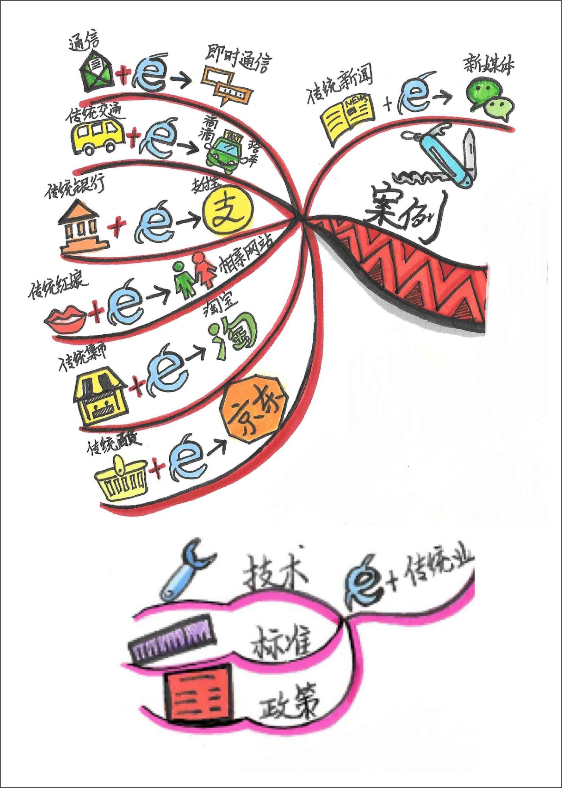 

## 小结

今天我们学习了阅读思维导图的方法，一共六个步骤：

第一步：了解主题意象， 
第二步：宏观整体架构， 
第三步：掌握分类层次， 
第四步：阅读细节内容， 
第五步：强调关键插图， 
第六步：重复重点内容。

这六个步骤可以帮助我们达到掌控全局，兼顾细节的思维模式——既见树木，又见森林。

当你想学会画导图的时候，**最好先学会如何看懂一张思维导图**，有了看的经验和能力后，我们学习“画”思维导图就更加事半功倍了。

# 2. 为思维导图设计一个中心

今天是课程的第二天，上节课我们学习了“阅读思维导图的方法——如何看懂一张思维导图”。今天我们进入动手绘制思维导图的环节。

这节课，我们主要学习两个知识：

1. 如何画思维导图的中心图 
2. 如何给思维导图选择颜色

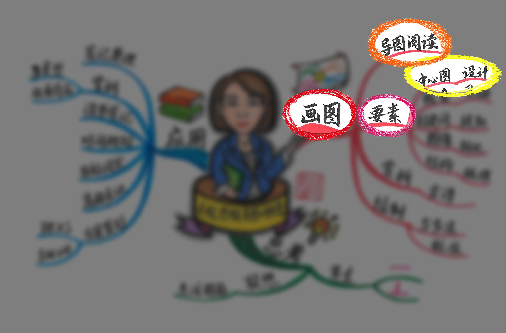 

## 2.1 了解思维导图

我们先总观一下思维导图全局，也是21天课程中我们在第一模块“会画图”这部分能学会的核心内容，这些内容主要包含：

**思维导图的三种形式**：全图版、全文字版和图文并茂版；

**绘制思维导图的六大核心要素**：心、线、词、图、色、构；

**绘制思维导图五大步骤**。

我们做道数学题：三种形式、六大核心要素、五大步骤，可以组成什么呢？组成了365这个数字，这个数字正好是一年的天数，那这样记起来是不是很容易？

我们学习思维导图一直提倡的是**一年365天要坚持每天画，争取早日成为导图达人**。我们可以用这个数字作为我们学习导图的一种激励。

我们先逐一学习思维导图的六大核心要素，这六大核心要素分别是：

**心——中心图； 色——色彩； 线——线条； 词——关键词； 图——图像； 构——结构。**

这一节课我们先从中心图和颜色开始。

## 2.2 中心图（Central Image）

现在我们可以试着开始画一幅思维导图了。

想一想，第一部分你通常会画什么呢？大部分的人可能会回答「先把主题画出来」。是的，通常我们会先**在纸张中间的位置画出本导图的主题，也就是「中心图」**。

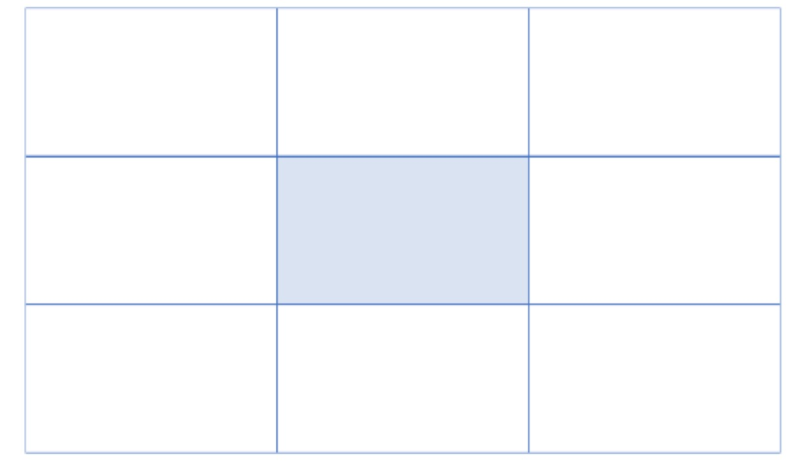 

**中心图**，指的就是中心主题，**它是整幅思维导图的焦点**。

绘制时最好**选取与中心主题内容相关的在大脑中第一次联想到的图像**，也就是第一印象，这样便于直观理解与记忆，印象会更加深刻。

举个例子：我们要确保团队聚焦到重要目标上。

看到这句话，我大脑第一时间反映出的画面是“靶子”，也就是**第一印象的图像**。我用“靶子”来代表这个句话的中心主题。

**那中心图要画在哪里呢？**

中心图位置的选择，对于**初学者**来说，可以用**叠九宫格**的方法，纸张中央的九分之一处就是中心图的位置，正如这张图所示：

 

对于**熟练者**来说，可以用**叠对角线**的方式，对角线交点四周的区域就是中心图大致的位置。 

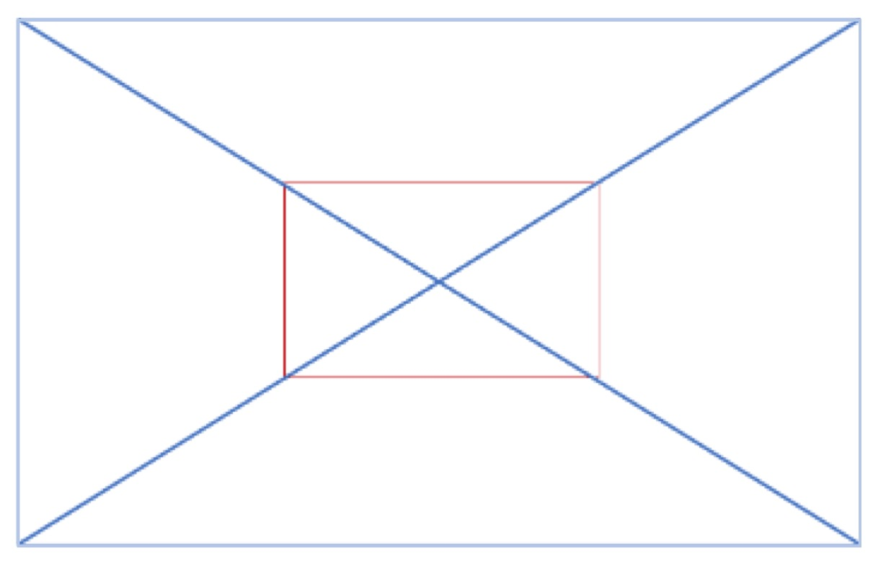 

再来说说中心图的大小要求，相对于A4纸来说，如果整幅思维导图的内容比较多的话，中心图可以略微小一些，但==最小不能小于一块钱硬币==；

如果整幅思维导图的内容比较少的话，中心图可以略微大一些，但==最大不能大于一张信用卡==。

为了方便我们职场人士快速绘制中心图，刘老师今天也给大家准备了一些通用的中心图模板，这些模板又被称为是**万能模板**，因为它们适用于任何主题的思维导图。

我们只需要在这些模板上面加上主题文字就可以了。你是不是想说这个看上去也会觉得有点难呢？不要管美丑，其实只要用简单的线条勾勒出大致的形状就可以了。

大家要记住：

无论是谁都不可能一下子画出一个特别完美的中心图，因为**完成比完美更重要**，所以我们**只有开始大胆的去尝试才能画得越来越好**！

**实践往往比知识本身更有价值。**

画思维导图也是一样，没有好不好，只有你去不去画。

你一学就会的思维导图，就让我们先从学会画思维导图的中心图开始吧。

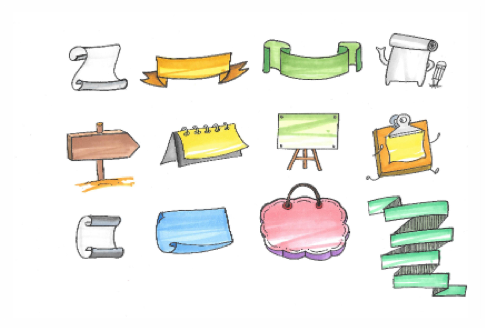 

上面的这些中心图大家可以尝试着进行临摹，争取把它们都默背下来，在以后绘制中心图的时候可以随时从大脑当中提取出来。

从左到右数，用的最多的就是**第一行的第一个图案、第二个图案，第二行的第二个图案和第三行的最后一个图案**。

下面我就把分解的绘制步骤教给大家，保证你一学就会。

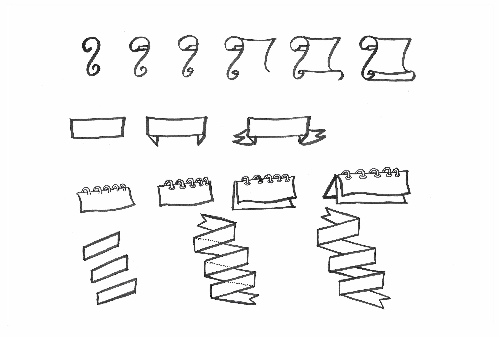 

## 2.3 颜色（Colour）

我们再来学习一下如何在思维导图中使用颜色。

有的小伙伴会说，画导图还要用颜色实在是太麻烦了。统一用黑色笔来画不是更高效吗？

下面给大家看两张图，你就明白为什么要用到颜色了。

下面这张图是北京地铁线路图，一张是黑白的，一张是彩色的，我们可以分别在两张图中做个实验：

快速找出7号线、14号线、15号线，看一看是在黑白图上找的快，还是彩色图上找的快？

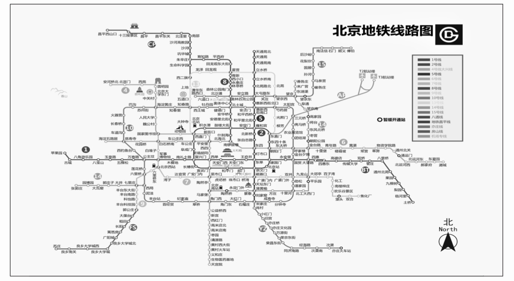 

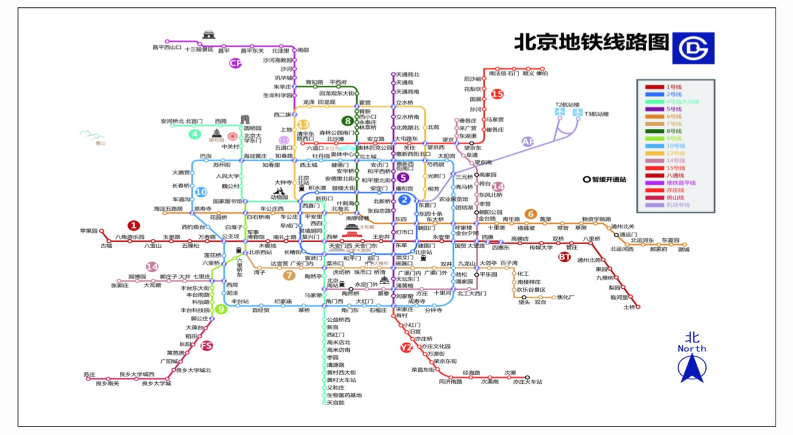 

经过相应找寻后，很显然是彩色的那一张更容易找出要找的线路，因为彩色版本的每条线路都采用不同颜色进行区分，就像我们思维导图线条的要求一样，一个大类别一种颜色，**色彩可以帮助我们缩短对信息的搜索时间，便于我们区分信息内容，为回忆提供线索**。

心理学家朗诺．格林（Ronald Green）指出，利用颜色传达视觉上的信息，可以提升80%的阅读意愿与参与动机。

《色彩的影响》（Colour for Impact）一书作者珍．怀特（Jan White）也认为颜色可以缩短82%的信息搜索时间，提升70%的理解度，提升60%的记忆效果。

这也是为什么我们要在思维导图中多用颜色的原因了。

在思维导图中我们一般会应用到**8种颜色，黑色是基础色**，也就是勾线色。其余是三组对比色，分别是：红绿、橙蓝、黄紫。还有黄色的替补色褐色。

那么中心图的颜色要求使用三种颜色以上，**最好使用美术色彩的三原色：红、黄、蓝**。

**线条的颜色要求一个信息类别一种颜色**，大类线条与大类线条之间要用颜色来区分，最好**使用对比色**（红与绿，蓝与橙，黄与紫）。

这里的黄色，建议用褐色代替，便于区分，**线条尽量避免使用黄色**，因为看不清楚。

**关键词的颜色**一种是和所承载的线条同色，另一种是全部黑色。

第一种形式的好处是节省时间，提高效率，便于更好地区分内容信息。

第二种形式的好处是整体结构内容更加醒目，便于产生新的想法。

**插图的颜色尽量使用“跳色”**，什么是“跳色”呢？

就是要与所在线条、关键词的颜色有所区分，不能与线条同色，这样才能达到激发创意，增进记忆效果的目的。

以上就是思维导图中使用颜色的具体要求。

下面我们来看一看刘老师画的这张关于“色彩性格分析”的思维导图。

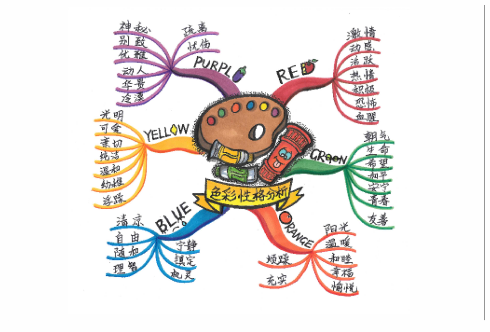 

我们用上一节学的的阅读思维导图的方法先来读一下这幅思维导图。

这幅图所要表达的中心主题是色彩性格分析，用“调色板、画笔、颜料”作为中心图图像，每个分支代表不同颜色的性格特质。

我们再来看看这幅图颜色的使用，中心图涉及到了8种颜色，分别是黑、红、绿、橙、蓝、黄、紫、褐。

**线条是一个类别一种颜色**，分别对应红、绿、橙、蓝、黄、紫。

**关键词用的全部是黑色，这样展示起来会更加清晰。**

**大纲主干上的图像颜色采用的是所要表达内容本身的颜色**，例如：苹果红色，嫩芽绿色，橙子橙色，眼泪蓝色，柠檬黄色，茄子紫色。

整幅思维导图颜色鲜明，让我们直观地感受到了颜色本身所代表的具体事物所要表达的含义。

所以，我们人类天生就是喜欢颜色的，人眼对于颜色的敏感度比对文字的敏感度大，可以带来乐趣，同时带来的感官刺激让人印象深刻。

## 小结

**中心图就是一张导图的中心主题，它是整幅思维导图的焦点。**

思维导图常用的三组对比色：

- 红绿
- 橙蓝
- 黄（褐）紫。

## 作业：临摹常用中心图

请临摹刘老师在课堂当中教给大家的下面这三种图的简单绘制步骤，争取把这三种图默背下来，今后可以灵活应用。

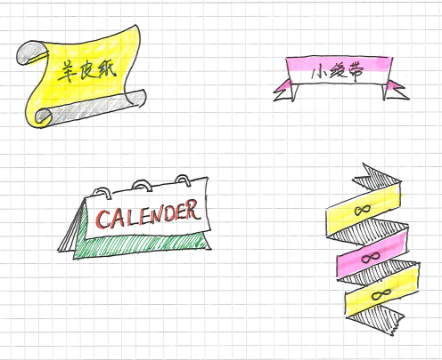

# 3. 画出自然灵动的导图线条

今天是课程的第三天，我要和大家分享的主题是“如何画出自然灵动的导图线条”。 

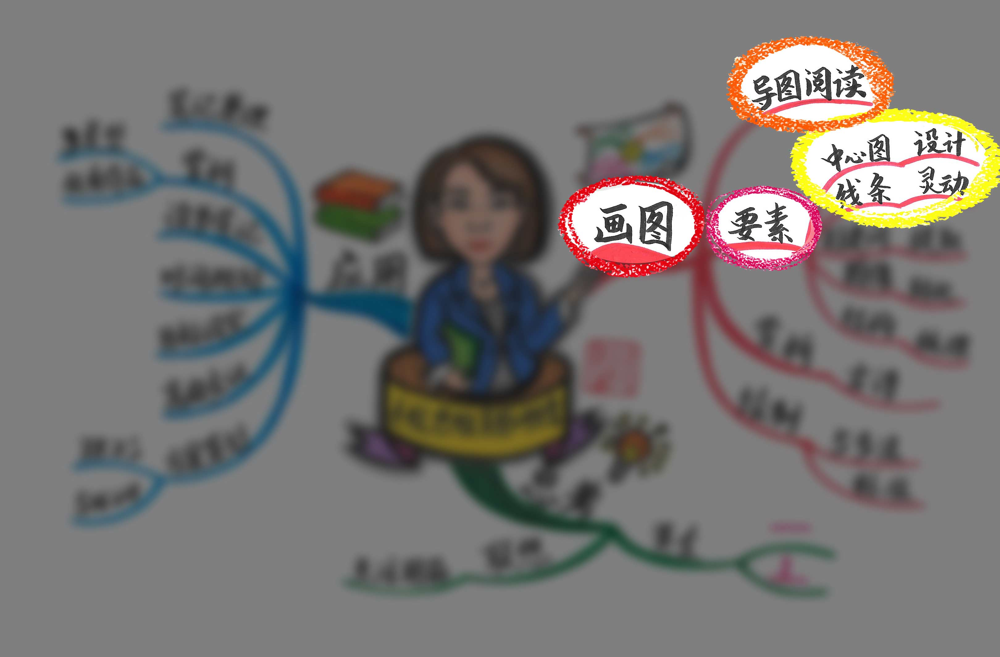 

能否在规定的时间内快速画出一幅高效的思维导图，很大程度上取决于绘制线条的速度。所以说**学会快速流畅地绘制线条是学习思维导图必须要掌握的一个基本技能**。

线条（Line）的轮廓大致分为两种： 

- “大纲主干（Main Branch）”， 
- “内容分支（Sub Branch）”。

能否在规定的时间内快速画出一幅高效的思维导图，很大程度上取决于绘制线条的速度。所以说**学会快速流畅地绘制线条是学习思维导图必须要掌握的一个基本技能**。

## 3.1 大纲主干（Main Branch）

先讲一下大纲主干的画法。

大纲主干的线条样式分为三种：**普通样式、禅绕画样式、艺术图像样式**。

大纲主干的线条必须与中心图紧密相连，**连接处不能断开，大纲主干必须是由粗到细的双线条**，类似于有弧度的锥形样式，最后消失于一点上。

那么创造思维导图的第一步就是**确定你的基本分类概念（Basic Ordering Ideas）的章节标题**，也就是“大纲主干”。

**普通样式**要么全部填充颜色，要么填充纹理，就像下图这样。同学们可以按照这个图临摹一下。

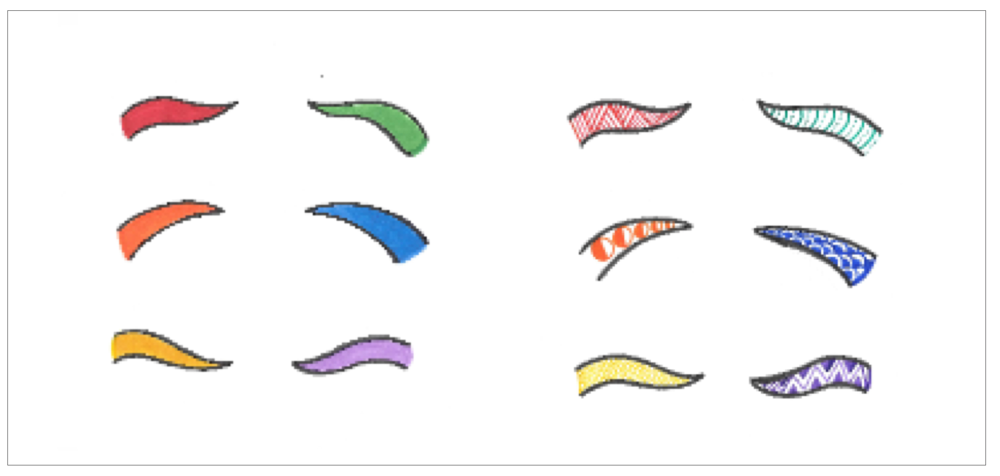 

**禅绕画样式**指的是大纲主干内的纹理图案，代表的是这个大纲主干上关键词的具体含义。

例如：舞蹈画的是芭蕾舞者，纽带画的是纽扣，工业画的是齿轮、婴儿画的是奶瓶等等。

禅绕画样式比较难，有绘画基础的同学可以跟着画一下，初学的同学可以欣赏一下。

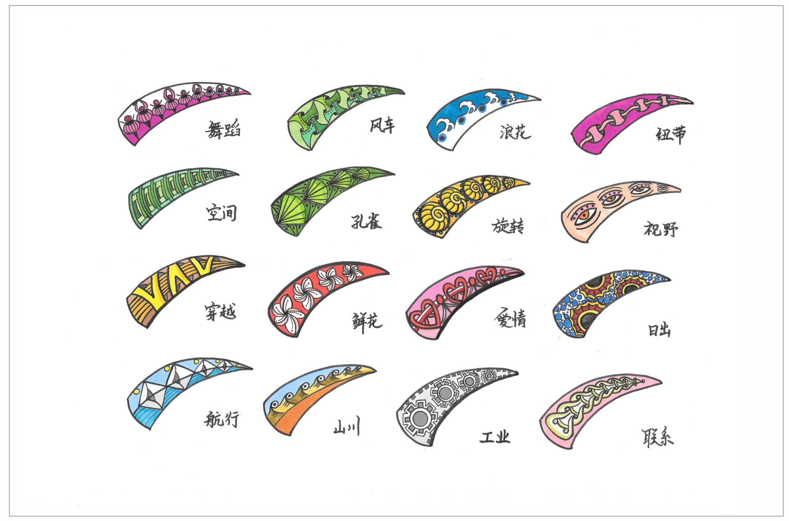

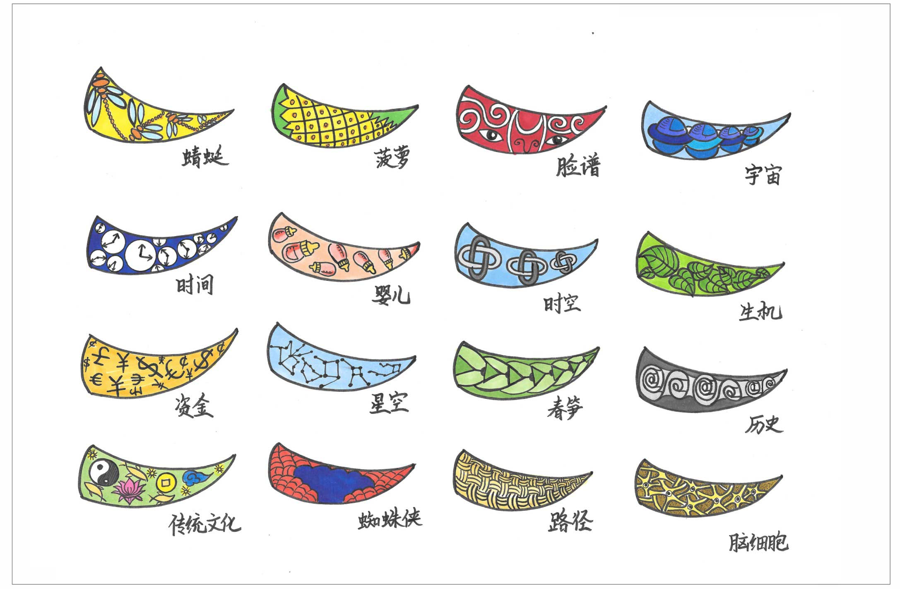  

**艺术图像样式**是把大纲主干全部画成图像，这属于绘制思维导图的**高阶技法**了。这个比较难，有绘画基础的同学可以跟着画一下，初学的同学可以欣赏一下。

这种形式一般应用在“世界思维导图锦标赛”这种竞技比赛上，或者是作为“礼物”送人，当作“展示品”展览时采用的方式。

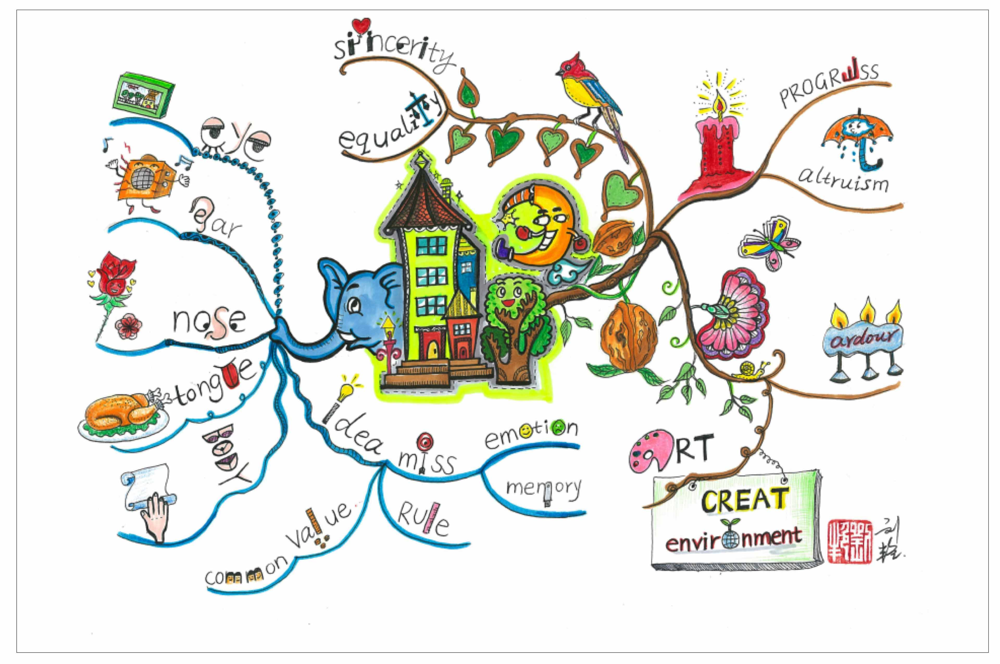 

## 3.2 内容分支（Sub Branch） 

思维导图也是如同“思维之树”一样，主干部分之后 会生长出分支。

我们现在来讲一下怎么画内容分支。思维导图的线条要求画得越自然灵动越好，这样才更具生命力。

内容分支的线条样式要求是要**用单个的弧线**，那什么是弧线呢？

圆上任意两点间的部分叫做圆弧，截取其中一部分即为弧线，而且要画 “水平状弧线”，弧线的走向一定要比较平行，也就是说，**线条上的关键词一定要让你自己能够直观地看到**，而不是要把纸的角度旋转120°才能看清楚自己写了什么。

下面就是一幅标准版的思维导图线条。

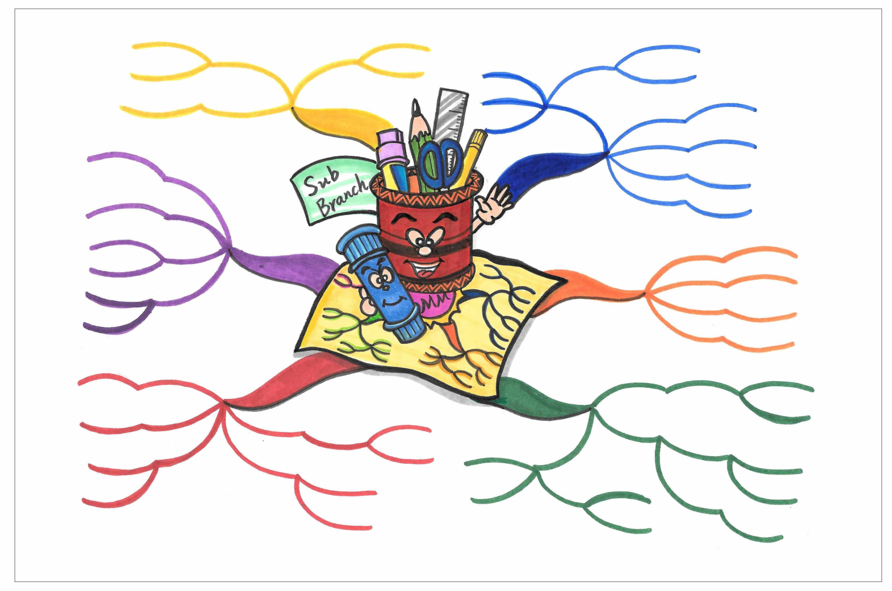 

关于线条的数量也是有要求的，**要求同级分支 ≤7 条，相当于是并列关系的线条要保证在 7 个以内**。

这样的要求背后也是有科学依据支撑的。根据美国哈佛大学心理学教授乔治·米勒 [George Miller] 提出的“神奇的7加减2”（The Magical Number Seven Plus or Minus Two）法则。

米勒教授发现，大多数人只能同时记住不超过七条新信息。所以我们选择**同级分支尽量保持在7条以内**，超过7条我们就要尝试将其进行归类，因为经过整合后的信息更便于记忆。

如果你画的主干太多，表明你的归纳能力还有待加强，有些内容还可以合并在一起。

那么有很多小伙伴就会产生这样的困惑，如果是七个并列关系的线条在纸上该如何呈现呢？请看下图，你就明白了。

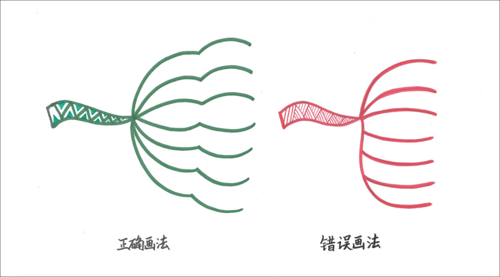 

**正确的画法**：所有同级分支线条的起点都始于大纲主干末端的一点。也就是说，**线条要求都是从同一点来延展开的**。

**错误的画法**：下面的4个分支是从其中的一个分支延展出的，这样的话呢就分不清线条之间的逻辑关系了。

我们再来看看线条层次，**相当于递进关系的线条，最好小于5层**。

讲完了思维导图线条的要求和绘制方法后，我们来做一个小小的练习，那就是尝试着在下面这张思维导图中来玩玩“找茬游戏”。

2分钟时间，看看谁的眼力最好，可以很快找出哪些线条不规范，存在一定的问题。让我们一起开始吧。 

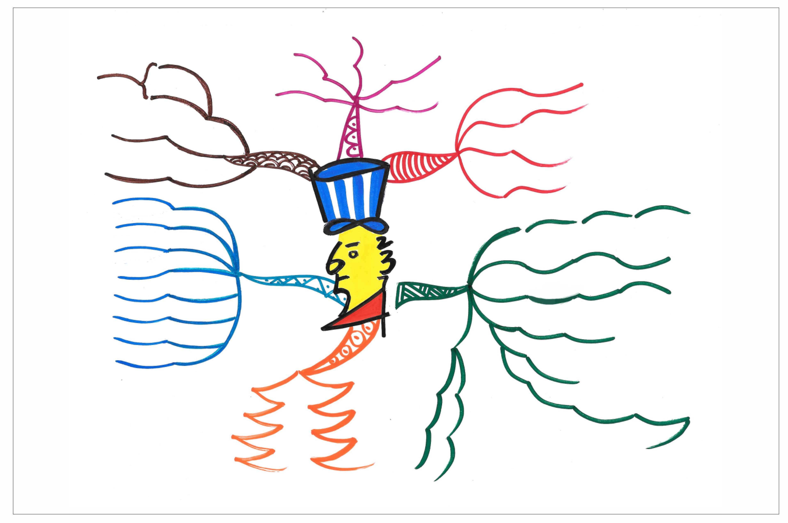 

- **红色线条**：大纲主干是由粗到细的线条，而不是中间粗两头细，**最好画成牛角状**，尽量不要画成树叶状；**内容分支是单个的弧线，而不是曲线**。
- **绿色线条**：绿色大纲主干与中心图没有连接上，中间断开了，**大纲主干必须要与中心图相连**；内容分支，**弧线与弧线之间不能断开**，线条走向不能呈现波浪状，应该往上就全往上，往下就全往下，每一个分支的起点都是从上一级分支的末端点开始的；不能画竖着走向的线条，因为这样的话就要把纸旋转90度来看线条上的关键词了，可以**尝试画弹簧线来拉伸线条把它放到合适的位置上**。
- **橙色线条**：不要画折线，这两条线组合起来看上去像棵圣诞树。
- **蓝色线条**：下面的4个分支是从其中的一个分支延展出的，这样的话就分不清线条之间的逻辑关系了。所有同级分支线条的起点都始于大纲主干末端的一点，也就是说，同级分支线条要从同一点来延展开。
- **褐色线条**：两个分支后面画了个括弧，再集合为一条分支。应该把集合的分支提前，后面再分别接两个分支；二级分支的起点应从大纲主干的末端点展开，而不是在大纲主干上任意展开。
- **紫色线条**：大纲主干呈现“冲天辫”似的线条，内容分支也是直上直下，应该为水平状有弧度的线条。

 修正后的线条  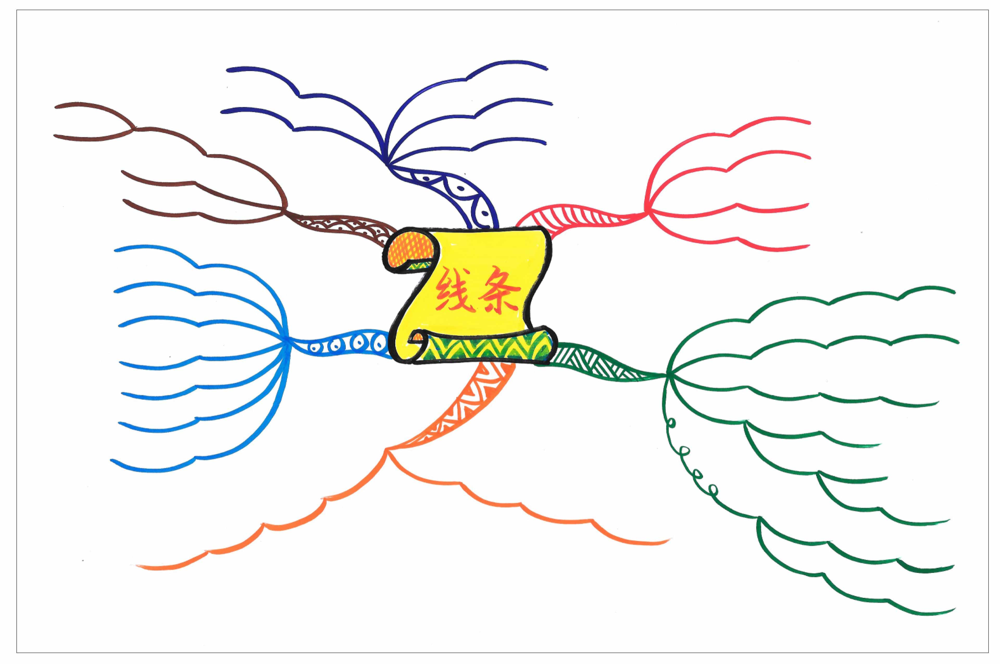 

## 总结

以上就是绘制思维导图线条的方法，一起来总结一下吧：

线条（Line）的轮廓大致分为两种：

一种叫做**大纲主干（Main Branch）**，另一种叫做**内容分支**。

大纲主干的线条样式分为三种：**普通样式、禅绕画样式、艺术图像样式**。

**内容分支线条要保证在7个以内,也就是同级分支小于等于7条，递进关系的线条尽量保持在5个以内**。

## 作业：绘制一个包含五个主干的和若干分支的思维导图的线 

# 4. 如何提取思维导图的关键词

今天是课程的第四天。我要和大家分享的主题是：**如何提取思维导图的关键词**。 

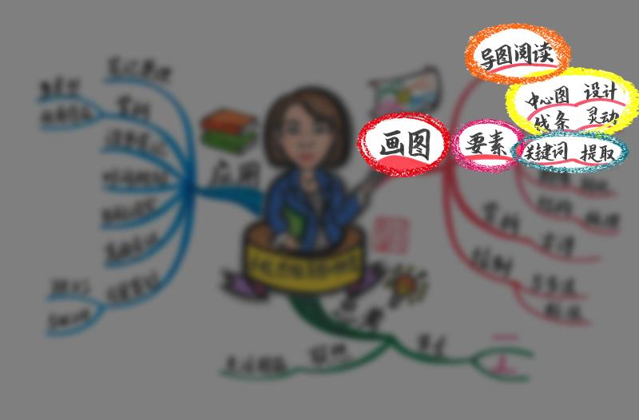 

我们来看下面这幅图，像黑框标注出的这些在线条上的词，就是我们今天要讲的“关键词”。 

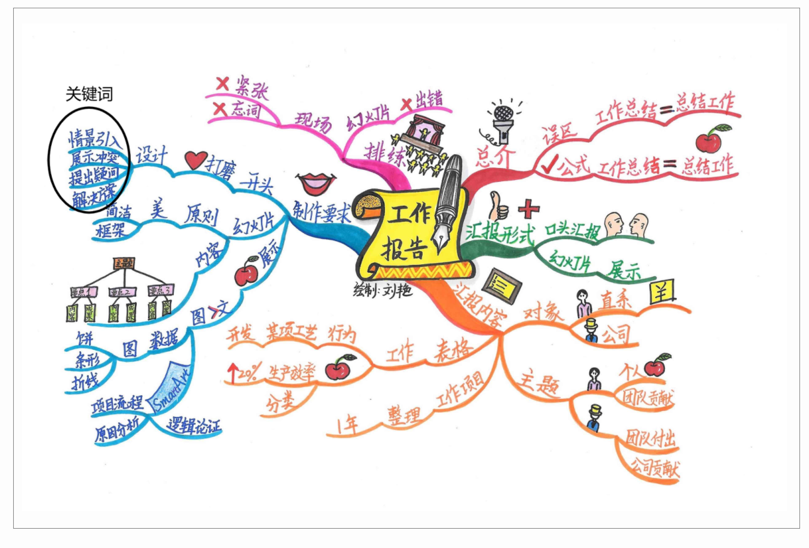 

## 4.1 什么是关键词？

**关键词**被誉为是大脑内部信息提取时的「搜索引擎」，它**是一段话中最具概括性和总结性、能够唤起大脑精准回忆的词语**。

下面加粗的字体就是这段中的关键词，通过这些关键词我们大致就能了解整段的核心内容了。

> **时间**有**三**重**特性**：交易、消费和投资。
>
> 你支付给老板每天**8小时、每月168小时**，老板回报给你**1万元**的工资，这是**交易**；
> 
> 你把自己珍贵的**2-4小时**“**不被打扰**”的时间拿来打**游戏**、看**电视剧**、刷**手机**等，这是**消费**；
>
> 你把这段时间用来学习**思维导图**，这就是**投资**。

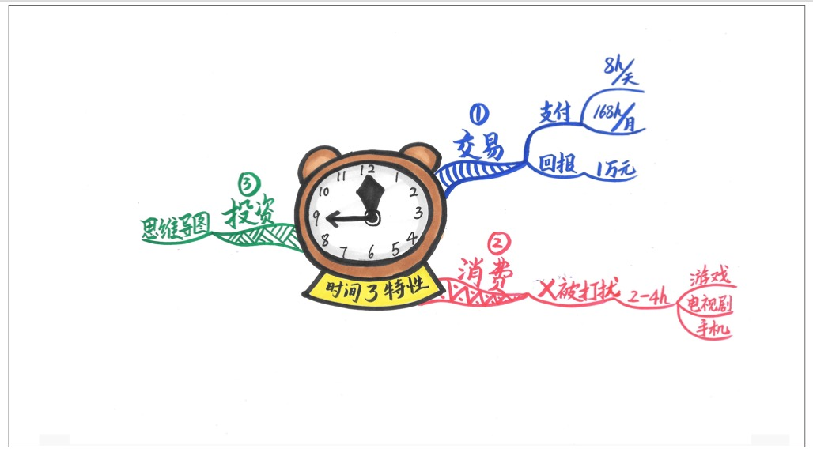 

究竟该如何提炼关键词？下面我就和大家一一分享。  

## 4.2 提炼关键词的原则（HOW）

### 4.2.1 如何选择关键词

关键词一般**以名词为主，动词为辅**，修饰词再次之。

因为名词、动词不仅是构成意思表达的基本元素，更是强烈可视化的词语，能强化我们对内容的理解和记忆。

**精简关键词的判断标准**：
$$
保留它不会影响你对内容的理解\\
省略它你会对内容产生误解\\
这样的词就应该保留。
$$

### 4.2.2 关键词的数量
$$
One \ Word \ per \ Line
$$
原则上讲是**一个线条只写一个关键词**。

中文最好是4个字以内，可以是1个字、2个字的词语或者4个字的成语

英文则为一个单词

为什么要坚持「一线一词」？我们来举个例子，你就明白了。

看看下面这句话的内容，尝试把它整理成导图的形式。例如：

> 思维导图高效工作法，归纳出了一系列实用有效的逻辑方法，可以帮助职场人士快速提升策划和沟通的核心竞争力。

拆解后的思维导图是下面这样的：

 

**紫色**部分的内容是**错误**的画法。

**绿色**部分和**蓝加橙色**的部分是**正确**的画法。

绿色部分的画法替「核心竞争力」「策划」「沟通」，保留了「思想的活口（思维的通路）」这项关键词的技巧，正如绿色虚线所表示的。

如果接下来我们还有什么新的想法，可以快速接在下一个层级的分支上，比如橙色部分，把相关的信息整合进来。

通过上面这个小案例，我们会发现**每一个关键词都会成为一个新的思考起点，借助它能产生更多新的想法**。

**坚持一线一词的原则**可以帮助我们保留一些弹性空间，我们把这些弹性空间称为**思想的活口（思维的通路）**。 

## 4.3提取关键词的窍门： 

我们再来讲讲如何精准地提炼关键词，这里给大家介绍5种非常实用的方法。

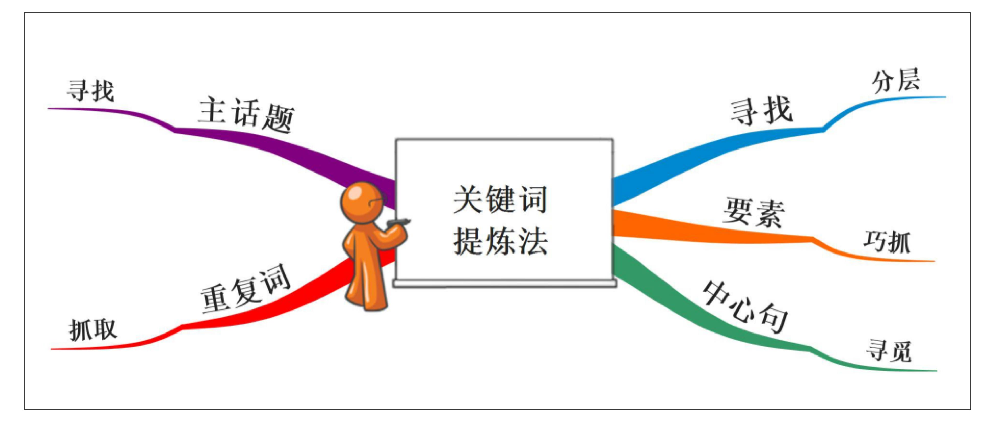 

在下面的案例讲解中我们不需要把一段文字中的所有关键词全部找出来，因为时间有限，我们**只找出一段文字资料中最最核心的3-4个关键词**就可以了，这样更加训练我们的“精简力”。

### 4.3.1 分层法

**分层法**，是最常用的一种方法，拿到一篇文字资料，**先思考**一下**这是什么体裁**的内容，是记叙文、说明文，还是议论文？

**紧接着**开始**划分层次**，**最后**再在文字资料中**找出最能概括每层层意的核心关键词**，首先是在原文当中找，如果原文中没有合适的词可以自己来总结概括。

一段文字有时是由几层意思构成的，而一些关键词往往就隐藏在这几层意思中，所以分层进行寻找。

例如下面是一篇说明类的文章，请根据其信息内容提取4个核心关键词。

> 人类喝茶的历史从神农氏尝百草时发现茶叶有解毒的功用开始，就与我们的生活有着密不可分的关系，远古时代茶被当成解毒剂使用，现代因为发现多喝茶有助身体健康，所以成为生活中不可或缺的饮料。
>
> 茶叶的成分除了有可以振奋精神的咖啡因之外，还包含单宁酸、维生素、蛋白质、矿物质等营养素。多喝茶有助身体健康，但要注意以下禁忌以免伤害身体：不要用茶水服药，睡前不要喝茶，不要喝太浓的茶，不要空腹喝茶，不要喝隔夜的茶 。 

**解析**

第一步**先通读**这段文字。

第二步**确定文体**，很明显这是说明文。

第三步**分层**,这段可以分成4层意思：

第①层：人类喝茶的历史从……百草； 
第②层：发现茶叶有解毒的功用……饮料； 
第③层：茶叶的成分……等营养素； 
第④层：但要注意以下禁忌……不要，五个不要结束。

经过这样的层次划分，再经过深入思考以后，4个核心关键词基本上就呼之欲出了：历史、功用、成分、禁忌。

### 4.3.2 要素法

**要素法**，可以**根据5W1H要素来划分，找到表示时间、地点、人物、事件、目的、做法的词**。

在一个语段中，有时**表明时间、地名、人称、物品的词语**往往就是关键词之一。

巧抓要素法，可以根据 **5W1H 要素**来划分，这些要素包含**WHEN 时间、WHERE 地点、WHO人物、WHAT 事件、WHY 目的、HOW 做法**，这样直接找出每个要素相对应的关键词就可以了

例如，请从下面论文简介中提取3个反应其主要信息的核心关键词。

> 这篇文章对中国文明进程中具有重要意义的“士”在先秦时期的演进做了全景式的追踪,有助于人们对“士”的源起及早期衍变形成一个完整而清晰的印象。     

**解析**

这段文字中哪个词表示时间?很显然是“先秦”； 
哪个词表示人称呢?当然是“士”。

这样就找到了两个关键词,还剩一个，再用其他方法去找，也很快可以找到是“演进”。这样答案就出来了。

### 4.3.3 中心句法

**中心句法**，就是**在一段文字中找到最能概括文段大意的句子**。

在这个句子当中**选取核心的关键词**或者是**与之相关联的核心关键词**。  

有的语段有比较明显的中心句，这个中心句，有的是**总结上文**，有的是**开启下文**。找到它，就一定能够提取到核心关键词。

例如， 提取下面一段话的主要信息，写出四个核心关键词。

> 从甲骨文到草书、行书的各种书法艺术，间接地反映了现实某些方面的属性，将具体的形式集中概括为抽象的意象，通过视觉来启发人们的想象力，调动人们的情感，使人们从意象中体味到其间所蕴含的美。这也就是一些讲书法的文章里常说的“舍貌取神”——舍弃客观事物的具体现象特征，而摄取其神髓。

**解析**

这段话总结上文的是最后一句，其核心是**舍貌取神**。而**貌、取、神**又分别所指的是3个关键词，**貌**指的是**意象**、**取**指的是**体味**、**神**指的是**神髓**。

这样就找到了3个，还剩一个，再用话题法去寻找，就可找到是**书法**了。  

### 4.3.4 重复词法

**重复词法就是要在一段文字中找到高频率出现的词语，也就是高频词。** 

一段文字资料中，有些词语会**多次出现**、**反复出现**，而这类词语，往往就是这个语段的核心关键词之一。

例如，阅读下面文字材料，提取3个核心关键词。

> 美国卡地夫大学的科学家近日起程，前往调查大西洋深处地壳失踪之谜。通常情况下，地幔由数公里厚的地壳所覆盖，但科学家发现，在大西洋中部约有数千平方公里位置内的地壳似大面积失踪，地幔直接暴露在水下3000米左右的海底。卡地夫大学地球、海洋与行星科学学院的海洋地质学家克里斯认为，这有如发现了地球表面的伤口。
>
> 他表示，该处虽不是地壳失踪的唯一之处，但可能是最有意义的一处。一般来说，当板块断裂后，地幔将涌出，形成岩浆。而这种通常的情况没有发生，说明一定存在某种原因。科学家希望了解该处的地壳是否从来就不存在，还是因为发生大规模地层断裂所致。如果事实果真如此，科学家希望搞清楚这种现象是怎么形成的，以及为什么会形成这种现象。
>
> 为了回答这些问题，克里斯将参加由特勒姆大学海洋地球物理系教授罗杰•塞尔所领导的研究小组，乘坐库克号科学考察船，前往停得角群岛和加勒比之间的区域通行考察。科学家将利用声的技术形成海底纳图像，并利用海下机器人钻取岩芯样本。科学家认为，这次考察将为深入研究和了解地幔提供一个难得的机会,并可能加深对板块的构造的理解。    

**解析**

读这几段文字,有几个词语是反复地、多次地出现，如**地壳**、**考察**、**失踪**,找到了这几个词语，答案就自然有了。这种题目说难也难,说容易也容易。

### 4.3.5 主话题法：

**主话题法** 就是首先要清晰地了解这段文字主要讲的是什么内容，根据主旨内容找出与之相关的核心关键词。 

任何一个语段，都是围绕着一个主话题来展开的，只要我们找到那些**体现主话题的词语**，也就找到了核心关键词。

例如:提取下面一段话的主要信息，写出4个核心关键词。  

> 据报道,我国国家图书馆浩瀚的馆藏古籍中，仅1.6万卷“敦煌遗书”就有5000余米长卷需要修复，而国图从事古籍修复的专业人员不过10人；各地图书馆、博物馆收藏的古籍文献共计3000万册，残损情况也相当严重，亟待抢救性修复，但全国的古籍修复人才 总共还不足百人。以这样少的人数去完成如此浩大的修复工程，即使夜以继日地工作也需要近千年。

**解析**

这段的话题是古籍修复的问题。所以，**古籍**、**修复**这两个词就是我们首先要考虑的。文段中通过一系列的数据告诉我们古籍修复的处境不妙，具体表现是事多人少，这样，我们就又可以找出另外两个关键词：**人才**、**不足**。

## 4.4 如何在思维导图中画出关键词？

提炼完关键词后，我们来看一看如何把关键词画在思维导图上吧。

### 4.4.1 字号的选择

**中文方面，大纲主干上的字要大些**，内容分支上的字要略小，最好是逐层递减，但我们在平时写字的时候往往不容易做到，所以**内容分支的字体可以统一略小些**。

**英文方面，大纲主干上的关键词要求全部大写，二级分支上首字母要大写，余下层级要全部小写。**

看下面的小例子：

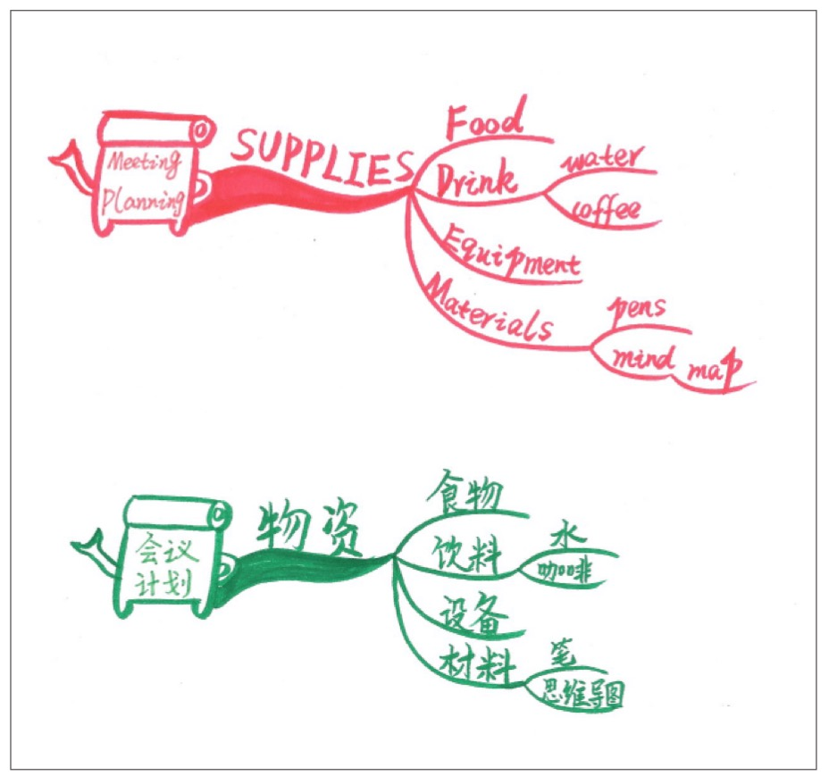 

### 4.4.2 字体的选择 

一般来讲，**主要关键词离中心图越近，次要关键词依据轻重程度逐层排序**。

关键词在每一个线条上的书写方向一律是**从左到右**，无论是写在左边的线条上还是右边的线条上。

讲求效率的话，就是**关键词和线条同色，画一个线条写一个关键词**，这样不用来回来去地换笔；

如果是做**展示用**还是建议**用黑色**，清晰直观。

下面我们来做个提取关键词的小练习，来巩固一下刚才所讲的内容吧。

例子：加粗的字体是这段内容的关键词。

**成功**的**演讲**有法可依——3V法则

**3V法则**的**理论依据**是**加州大学梅拉宾**教授的研究：

一个人对他人的印象，约有**7%**取决于他讲话的文字和内容，约有**38%**取决于音量、音质、语速、节奏等声音要素，高达**55%**的印象，则取决于眼神、表情、动作等形象因素。

从这三个大维度，作者推导出了影响演讲效果的3V法则：

第一个V，即**视觉**（visual），包括**眼神、表情、动作**等**形象因素**；

第二个V，即**听觉**（vocal），包括**音量、音质、语速、节奏**等**声音要素**；

第三个v，即**语言**（verbal）,表示讲话的**文字**和**内容**。

下面我们根据相关要求，把关键词画在线条上。

 

这张思维导图的**字体大小就是大纲主干最大，然后内容分支逐层递减的**，这也体现了关键词的重要程度，**离中心图越近的关键词越重要**，代表大的分类概念，比如视觉、听觉、语言。

线条上关键词的**书写方向**一律是**从左到右**。

这张思维导图是**作为展示用**的，所以写的是**黑色的关键词**。

## 总结

以上就是学会提炼关键词的方法，一起来总结一下：

**关键词一般以“名词”为主，其次是“动词”**。

**原则上**讲是**一个线条只写一个关键词**。

提炼关键词有5种方法。

**方法一：分层寻找法**； 
**方法二：巧抓要素法**； 
**方法三：寻觅中心句法**； 
**方法四：抓取重复词法**； 
**方法五：寻找主话题法**。

## 作业：提炼关键词

下面一段话是对“微公益”的说明，请提取主要信息，写出四个核心关键词。

> 随着社会的进步和人们生活水平的提高，越来越多的普通人开始参与到公益事业中来，于是一种草根公益应运而生，这就是微公益。
>
> 微公益提供了一个很好的平台，人们将微不足道的爱心汇集起来，积少成多，就形成了一股强大的社会力量，微公益关注贫困，关注教育，关注社会发展，关注生物保护和低碳等，具有很强的利他性，他没有过去大慈善者那种“行侠仗义”“扶贫济困”的远大抱负，取而代之的是寓善于乐的参与方式。

# 5. 如何把文字转化成插图

今天是课程的第五天我们要学习的内容是：**把文字转化成插图**，也就是**画思维导图的图像**。 

## 5.1 什么是思维导图中的图像？

针对思维导图中的一些重要信息，我们可以采用**视觉元素来突显重点**，强化记忆，这些视觉元素就是**图像**。

具体来讲，**图像**指的就**是画在重要关键词旁边的，能够代表相应含义的插图、代码、符号**。我们来看看下面这幅图你就明白了。

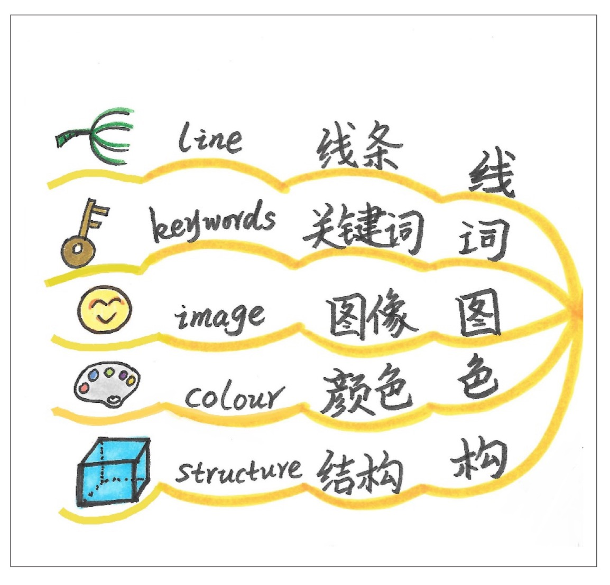 

## 5.2 为什么在思维导图中要用图像语言？(WHY)

想要对某事物进行说明的时候，语言和文字是比较方便的手段。

但根据具体内容，语言和文字有可能过于说明性，或者叙述起来过于冗长。

在这种用语言表达不会很顺畅的时候，**运用图像语言，可以使信息的整理达到新的高度**。

例如我在一家煎饼店吃煎饼，因为非常美味，便向老板询问这种煎饼的制作方法，老板说了一大堆，我也听的是一知半解，旁边的店员向我指了指墙上画的这幅图，我看到后瞬间豁然开朗。

这幅图直观呈现出了**关键图**和**关键词**，可谓一目了然！

这就是**黄太极煎饼果子制作流程图**，一共八个步骤：

1摊→2敲→3撒→4翻→5放→6刷→7折→8装。

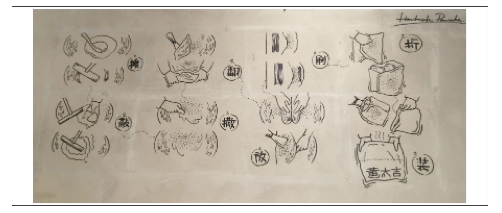 

思维导图的发明人东尼博赞先生曾经说过这样一句话：**Mind Maps prove that one picture is worth vastly more than a thousand words!**

这句话的英文的解释是： 一图胜过千言万语，一图值千字！ 

科学家们曾经做过这样一次实验：

他们以每秒钟一幅的频率向600人展示图像，展示完毕并开始测试精准回忆时，全组中有98%的人可以进行精准回忆。

所以实验证明：单纯记忆图像比记忆词语容易很多。

**图像不仅是强大的信息传递工具，还是语言的图形化补充，能够吸引众人眼球，使信息的传递更加顺畅**。

**善于使用图像可以解决许多问题**：

比如需要文字说明但纸张空间不足； 
工作太忙，没有时间作详细说明； 
沟通谈判时，语言不通等诸如此类的情况。

比如说，产品的使用说明书就需要配合大量的图示来进一步说明便于具体操作。

单纯的文字说明是无法给人留下深刻印象，无法给人带来说明感，无法进行井井有条地说明，那么**辅助图像语言，可以我们在大脑中呈现出画面感**，就可以直观说明了。

在**思维导图中，核心的关键想法被图像取代**，可以加深对想法的印象，便于深刻记忆。

**关键词是记忆触发器，图像语言是视觉激发器**，我们将**二者结合**在一起效果更佳，这样做可以**建立全景思维**，通过图像信息来探索复杂信息之间的联系与结构！  

## 5.3 如何运用思维导图中的图像？

思维导图中的图像包含四种形式：**插图、代码、符号、图像字**。

**第一种形式：插图**。

我们来看看究竟什么是插图？

**插图**：是指插在关键词中间用以说明其内容的图画。插图，在拉丁文的字义里，原是**照亮**的意思。

插图在整幅导图中也起到**照亮**提示的作用。通常我们绘制的插图大多是**简笔画**，简笔画的特点就是简单、易画。

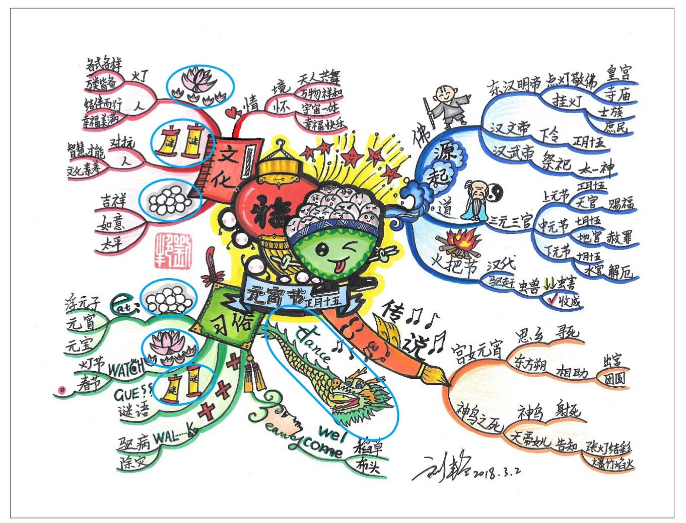 

我们来看上面这幅图中，画蓝圈的图像就属于是插图，分别是元宵、花灯、灯谜、龙灯。**关键词的本意是什么，就画什么**。 

**代码**指的是**用简单的图形代表相应的含义**。这些代码要能迅速让你联想到初始的知识，因为我们记住的是视觉图像，而不是抽象信息本身。 

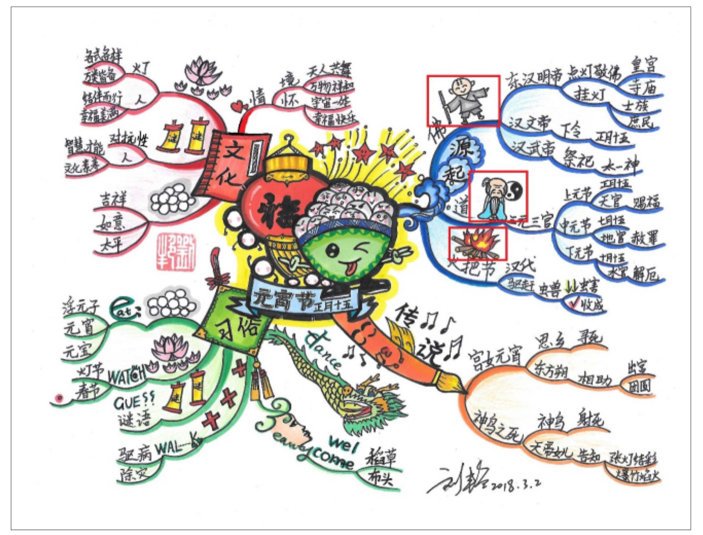 

红框中呈现的就是代码。

**佛**用**小和尚**代替; 
**道**用**老子**代替； 
**火把节**用**一堆火**代替。

除此之外，大纲主干用的也是**代码**： 
**起源**用**水浪**代替； 
**传说**用**唱着歌张开翅膀的毛笔**代替； 
**习俗**用**中国结**代替； 
**文化**用**一本古代线装书**代替。

下面给大家展示一下我的图像库中都有哪些常用的代码，这些大家可以拿来直接用。

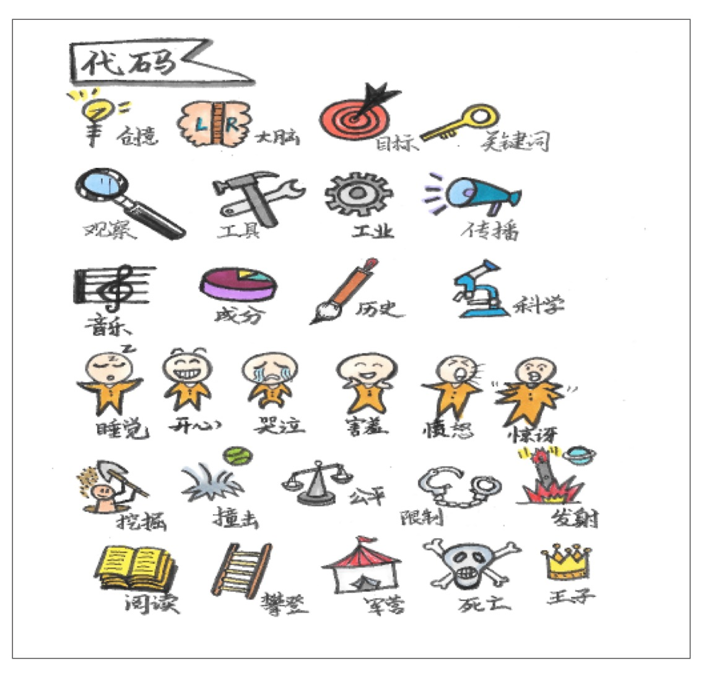 

**创意**，我想到的是**灯泡**； 
**大脑**我想到的是**左右脑，L代表左脑，R代表右脑，中间像直尺一样的图形是胼胝体**； 
**目标**画了个**靶子**； 
**关键词**画了一把**钥匙**； 
**发射**想到的是**火箭卫星**。

总之我们可以画出很多很多的代码，形成自己的**代码库**。

**第三种形式：符号**。

**符号来源于规定或者约定俗成的记号或标记**。这些符号是我们身边经常可以见到的，一看就知道它要表达的意思。

我们再看看这幅导图，看看哪些属于符号。

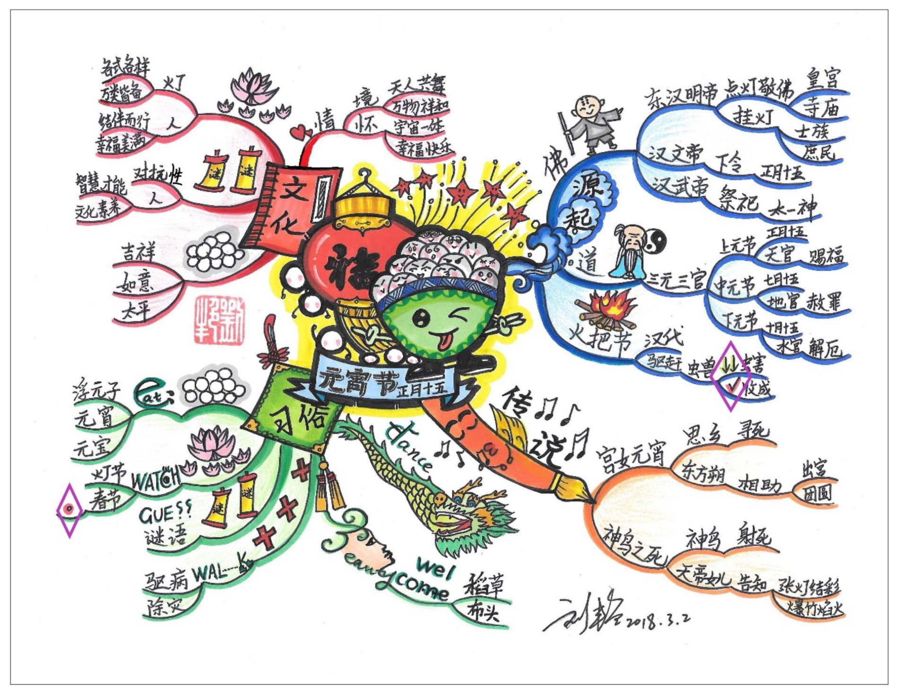 

菱形紫框呈现的就是符号。

**句号**表示**结束**； 
**向下的箭头**表示**减轻**； 
**对勾**表示**获得**。

让我们来回顾一下在我们身边存在的符号吧。

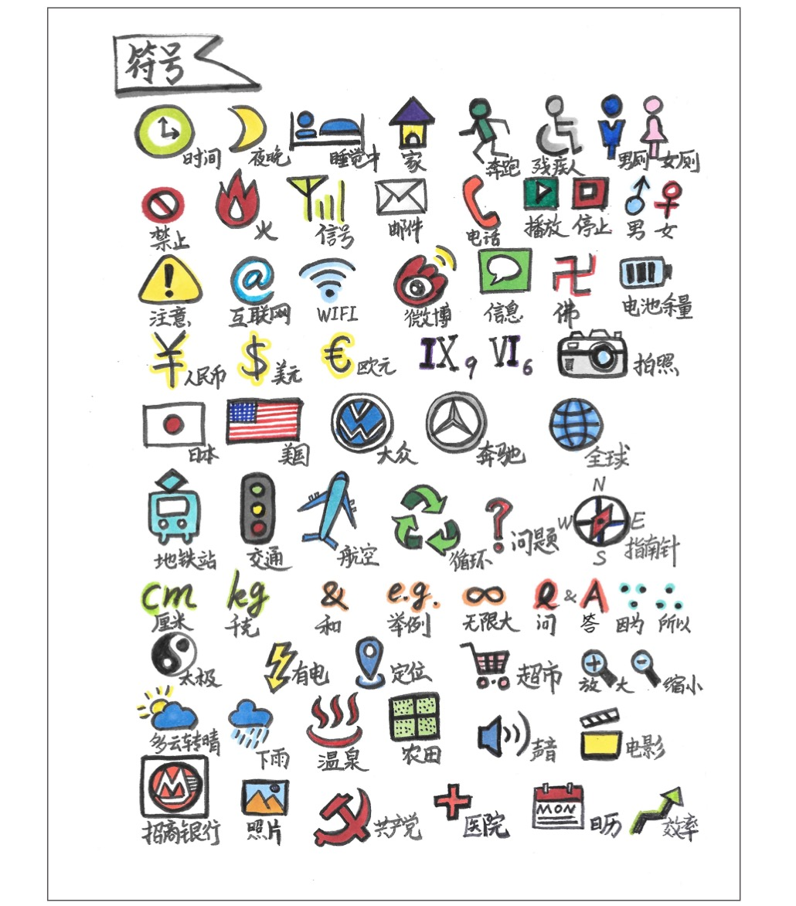 

只要我们平时留心观察身边的万事万物，你会发现画图是件非常容易的事情，一点儿都不难，而且会让你的心情变得愉悦。         

**图像字指的是图像和文字融为一体，成为一个说明元素，更能直观表达相应含义**。

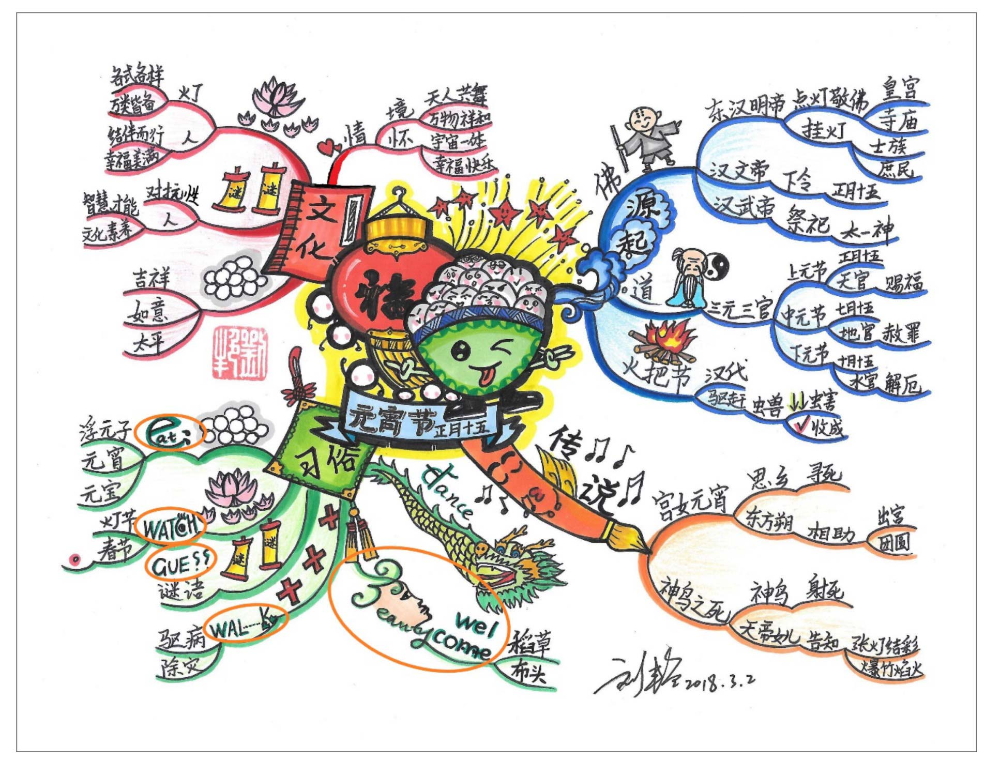 

橙色框内的都属于英文图像字，分别是：eat 吃、watch 看、guess 猜、walk 走、beauty 呈现的是一个美丽姑娘的脸庞、welcome 迎。

我们一起来看看刘老师过去画过的一些英文图像字和中文图像字，希望对你有所启发。

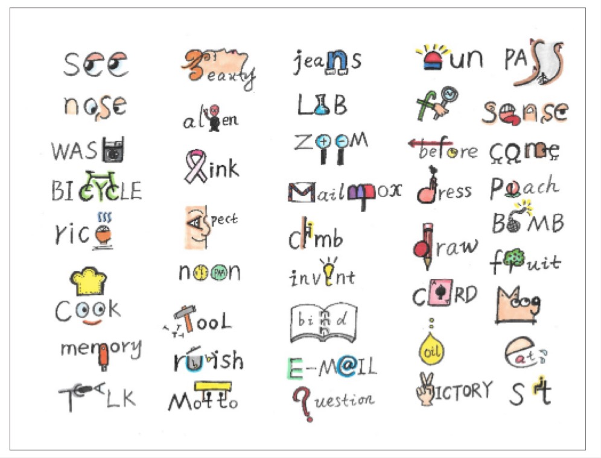 

我们要用好这四种图像的表现形式，**在重要的关键词处添加相应的图像**，这样做有助于激发创意，更能强化对内容的记忆效果。

### ## 5.4 插图的原则

那么，如何在思维导图中添加图像呢？有没有相应的要求和标准呢？

下面我们就来讲一讲出图的原则。

**图像的运用要遵循聚焦原则**，不能会画哪个就画哪个，而是要在重要的、难理解的、抽象的、易忘的地方出现图像。

**图像通常画在线条上，或者画在所要表达的关键词旁边。**

**图像必须能够明确表达代表的内容，或与该内容能够产生联想。**

**抽象词转换形象图像的方法**

在绘制这些图像的时候，有很多伙伴会有这样的疑问，那就是形象词是容易出图的，可那些抽象词是不容易出图的，该怎么办呢？

我们**遇到抽象词**时，要**先学会把它变为形象词，然后配以相关图像说明**。

抽象词变为形象词有以下5种常用的转换方法：

1、**谐音法**

就是**把和抽象词读音相同或相近的形象词来替代抽象词**。

2、**替换法**

有些抽象词是对许多形象词共有特征的概述，所以可以**从相关形象词中选择一种来代替该抽象词**，通过对相应抽象词的理解，用相关的、有代表性的事物、动作来代替，或者用能直接联想到的某个情景画面来代替。

**要特别注意转化之后还需要容易还原回去**。

例如： 
时间——手表、闹钟 
思想——大脑、灯泡 
寒冷——雪花、企鹅 
传统文化——毛笔、中国结

3、**倒字法** 

4、**增减字法**

5、**顾名思义法** 

## 总结：

以上就是思维导图图像绘制的理论和方法，一起来总结一下：

**图像**指的就**是画在重要关键词旁边的，能够代表相应含义的插图、代码、符号**。

思维导图中的图像包含四种形式：**插图、代码、符号、图像字**。

## 作业：把词语转化为图像

尝试着用**抽象词变为形象图像的5种常用转换方法**把下列词语转化为图像。
我们看看哪位伙伴画的图像最有趣，最能直观表达这些抽象词（任选1-2种完成）。
函数   距离   抽象  我爱我家  博爱  支撑