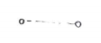
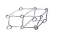
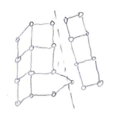
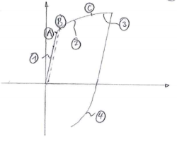

[TOC]

# 变形与断裂的物理机制基础

Physical Mechanisms of Deformation and Fracture

本节的目的是介绍主要的材料（金属 etc.）的材料结构，变形和断裂的机制。

基本的物理机制是宏观唯象理论假设的前提。

宏观理论是微观离散实体（原子到晶体结构）的诸多现象均匀到连续宏观而成的。

不同材料尽管在性质和结构上有很大区别，却都具有许多相同的行为（虽然也许在不同的层级和情况下）。

## 金属材料

### 材料结构 Structure

- 由原子通过电磁力（金属键：共用外层电子）互相连接排列而成的晶体 Crystal

- 在三个方向上进行重复的格子 Lattice 是晶体的基本组成单位

- 单晶 Monocrystal 和多晶 Polycrystal。

  金属由液态产生，生成稳定的晶体的过程是随机的，最终生成的晶体结构方向也是随机的。

  尽管方向随机，多晶在宏观上表现为各向同性。

-  宏观均匀后的理想晶体模型仅能描述弹性变形和脆性断裂，描述塑性变形和延性断裂要引入 Crystal Defects  

   的概念

### 变形的机制 Physical Mechanisms of deformation

- 弹性变形发生在原子层面

  

- 塑性和粘塑性变形发生在晶体层面，可以是 Korn 内的也可以是跨 Korn 的。

  晶界不太发生变化 （Ratio 晶界变形 / Korn 变形 小 ）。

  位错 Dislocation 是发生塑性变形的根本原因。

  

  

### 多晶体的变形 Deformation of Polycrystals during uniaxial Loading

 这里是一些共同的特性：

1.弹性阶段 Elastic Deformation

A.理论弹性极限 B.实测弹性极限 （A,B 为 Elastic Linit）

2.塑性阶段 Plastic Deformation （剪应力最大处变形）或 硬化阶段 Hardening （位错运动受到阻碍）

3.粘塑性 Viscs - Plastic Deformation， 变形不再平衡了，产生流动。

4.永久变形会造成各向异性，（残余应力）引起 Bauschinger Effect 。

###  断裂的机制 Physical Mechanisms of Fracture

- 变形（无论塑性，弹性）不是引起 Fracture 的根本原因， 因为他们本身是建立在材料连续的基础上的。
- Fracture 涉及到更大范围的较多晶体
- Fracture 的基本机理是由解理 cleavage 导致的脆性断裂和由较大塑性变形导致的延性断裂

#### 脆性断裂 Brittle Fracture

- 无明显塑性变形时，就发生原子键的断裂。
- 原因：局部应变能在发生塑性形变前（形成许多阻碍前）就已经过高。
- 由于缺陷而造成的应力集中。

#### 延性断裂 Ductile Fracture

- 晶体中（ i. A. 缺陷附近）塑性变形较大发生失稳的， 便会产生延性断裂。
- 根据定义，总体表现出脆性断裂的结构也有可能是定性上的延性断裂。
- 缺陷附近常有应力集中，会有较大的塑性变形：产生的不稳定会造成解理，从而产生微裂纹，从而造成局部颈缩（应变能过大），造成断裂。

根本原因和脆性断裂是一样的。

#### 疲劳断裂 Fatigue Fracture

- Accommodation or Nucleation Phase ： 即使力很小，总有地方会出现集中和塑性变形，从而发生硬化，升温（软化），形成更大的缺陷

- Initiation Phase of Microcracks ：”更大的缺陷“ $\rightarrow$ 微裂纹 （很难观察和确定）发生在与最大应力呈 45° 角。（由最大剪应力）

- Growth Phase of Microcracks ： 微裂纹生长在与最大应力呈 90° 角（由最大应力）尺寸积累到一定程度时，便有了一个比较确定的方向。此时，它便会考虑其他的微裂纹，寻找一个能量更低的方式扩展，有可能导致其他裂纹闭合。

  再达到一定程度便是宏观裂纹，材料不能再视为匀质。

- Growth Phase of Microcracks ：裂纹交替开合导致局部塑性流动，局部不稳定从而解理。达到一定尺寸便会进入总体不稳定状态，快速扩展。

# 真实固体的鉴别和流变学分类

Identification and Rheological Classification of Real Solids

连续体力学和热动力学是描述变形和断裂的基础理论工具。

使用这些工具，我们对不同的现象使用唯象方法分别建模。

本章就是在说这些模型。

我们将给每种材料，根据其主要现象分配一个模型。

## 总体唯象方法 the Global Phenomnological Method

描述材料本构关系的方法有三种：

1. Microscopic Approach：从原子，晶体结构层面对变形和断裂进行描述，再在RVE上进行积分或平均化，从而得到宏观性质。

2. Thermodynamic Approach：在与真实介质等价的抽象连续介质上，使用 Marcoscopic Internal Variable（热力学势）描述微观上的变形和断裂
3. Functional Approach：使用宏观变量与材料的特征函数（采用泛函法推导出的积分关系）描述微观现象在宏观上的表现。

这三种方法中，1. 和 2. 的变量是不可测得的；3. 中的变量历史亦不可得。

故，我们将采用总体唯象方法 Global Phenomnological Method 对材料的本构关系进行建模。

==即，通过研究 RVE 上的输入与响应来推断材料的本构关系。==

这是一种描述材料特征的框架性方法，得到的是替代性的本构关系，并不是真正的本构关系。

